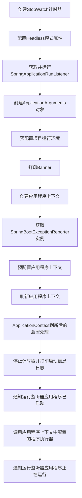

- [ ] JVM
  
  - [ ] 内存泄漏
    
    - [ ] 如何解决

NIO netty

spring cloud gateway

- gateway 跟 sentinel 有什么区别, sentinel 同样可以做到限流,降级

ElasticSearch

dubbo

oauth2

- oauth2 授权

rabbitmq/RocketMQ

- 如何保证MQ消息不丢失

springboot ＋ vue

Spring Cloud Alibaba是一个基于Spring Cloud的微服务框架，它整合了Alibaba的一些开源组件，以提供云原生应用程序的基础设施。以下是Spring Cloud Alibaba的一些核心组件：

1. Nacos：一个易于使用的、功能强大的动态服务发现、配置和服务管理平台。Nacos可以替代Spring Cloud Eureka作为服务注册和发现中心，同时还提供了分布式配置管理功能，类似于Spring Cloud Config。

2. Sentinel：一个轻量级的流量控制、熔断和系统负载保护组件。Sentinel可以替代Spring Cloud Hystrix作为服务降级和熔断器实现，提供更细粒度的流量控制策略。

3. RocketMQ：一款高性能、可扩展的消息中间件。Spring Cloud Alibaba提供了与RocketMQ的整合，使得开发者可以方便地实现分布式事务和事件驱动架构。

4. Seata：一个分布式事务解决方案，支持AT、TCC、SAGA和XA模式。Spring Cloud Alibaba提供了Seata的整合，帮助开发者在微服务环境中实现分布式事务。

5. Dubbo：一个高性能的RPC通信框架。Spring Cloud Alibaba提供了与Dubbo的整合，使得开发者可以使用基于Dubbo的服务间通信，而不仅仅是基于HTTP的RESTful API。

6. Spring Cloud Alibaba OSS：一个与阿里云对象存储服务（OSS）的整合组件，提供了简单的API来与阿里云OSS进行交互，如上传、下载、删除等操作。

7. Spring Cloud Alibaba SMS：一个与阿里云短信服务（SMS）的整合组件，提供了发送短信的简便方法。

8. Spring Cloud Alibaba SchedulerX：一个与阿里巴巴SchedulerX定时任务调度中心的整合组件，提供了简单的API来创建、查询、更新和删除定时任务。

通过使用Spring Cloud Alibaba，开发者可以利用Alibaba的一些核心组件来构建云原生应用程序，同时仍然享有Spring Cloud所提供的抽象和简化。这些组件可以帮助解决分布式系统中的常见问题，如服务发现、配置管理、负载均衡、熔断和降级等。

---

- [x] 🍕 juc 多线程  
- [x] 🚁  SQL  优化  
- [ ] 🍟 JVM 入门/优化  
- [x] 🌭  zookeeper  
- [x] 🧂 spring cloud  
- [x] 🍔 mysql  
- [x] 🍕 spring 创建类 + 生命周期 + 循环依赖 + Spring事件驱动模型(观察者模式)  
- [ ] B+ LSM树 红黑树 位图 https://blog.csdn.net/qq_39390545/article/details/108232888  
- [ ] 设计模式的六大原则 + 监听器模式 +  
- [ ] 排序 快速排序  
- [ ] redis 原理 https://pdai.tech/md/db/nosql-redis/db-redis-overview.html  
- [ ] 🚗  握力器 > 左-0 右-30  
- [x] java8 -> java17之间的变化特征  
- [x] spring bean生命周期 + 循环依赖 + spring web原理  
- [ ] aop 整理一下从@enableaspectJProxy -> 调用链 原理  
- [x] PDF 阿里巴巴规范  
- [x] spring 原理, 我们从哪里跳进去我们的源码呢?  
- [x] 数据脱敏  
- [ ] springcloud 限流  
- [x] springboot web返回 ResponseEntity  
- [x] idea调用接口  
- [ ] 锁的种类, 如何升级  Sychronized的锁升级过程是怎样的? https://www.yuque.com/renyong-jmovm/dadudu/prsemwubgm0n33qb  
- [x] spring  @ManageBean @Named @Lookup  
- [ ] API性能 - 代码优化 - 如何监控接口耗时, redis耗时, 数据库耗时  
- [x] 如何提高项目启动速度  
- [x] java中 <? extends T> <? super T>  
- [ ] 看完 JVM 之后再续前缘  单机版我觉得  JConsole  JStack  远程单机版  开源用 VisualVM Arthas  有钱可以用 JProfiler  分布式  Prometheus  Skywalking

*DevOps*（Development和Operations的混成詞）是一种重视「软件开发人员（Dev）」和「IT运维技术人员（Ops）」之间沟通合作的文化、运动或慣例

Servlet容器

- Tomcat

Person: 

- 请帮我在springboot写一个 Redis 秒杀案例

ChatGPT: 

- 好的，下面是一个简单的Redis秒杀案例，基于Spring Boot实现。

首先，我们需要在pom.xml文件中添加以下依赖，以使用Spring Boot和Redis：

```xml
<dependency>
  <groupId>org.springframework.boot</groupId>
  <artifactId>spring-boot-starter-web</artifactId>
</dependency>
<dependency>
  <groupId>org.springframework.boot</groupId>
  <artifactId>spring-boot-starter-data-redis</artifactId>
</dependency>
```

接着，我们需要在application.properties中配置Redis连接信息：

```properties
spring.redis.host=localhost
spring.redis.port=6379
spring.redis.password=
spring.redis.database=0
```

然后，我们需要编写一个Redis秒杀服务类，如下所示：

```java
@Service
public class RedisSeckillService {

  @Autowired
  private RedisTemplate<String, Object> redisTemplate;

  /**
   * Redis秒杀
   *
   * @param seckillId 秒杀商品ID
   * @param userId    用户ID
   * @param count     秒杀数量
   * @return 秒杀结果
   */
  public boolean seckill(long seckillId, long userId, int count) {
    String key = "seckill:" + seckillId;
    ValueOperations<String, Object> operations = redisTemplate.opsForValue();
    Long stock = operations.increment(key + ":stock", -count);
    if (stock < 0) {
      operations.increment(key + ":stock", count);
      return false;
    }
    operations.increment(key + ":sales", count);
    return true;
  }

}
```

在Redis秒杀服务类中，我们使用了RedisTemplate来操作Redis，并实现了一个seckill()方法，用于执行秒杀操作。在seckill()方法中，我们首先使用increment()方法来减少秒杀商品的库存，如果库存不足则返回false，否则增加秒杀商品的销量并返回true。

最后，我们需要编写一个Controller类，用于接收秒杀请求，并调用Redis秒杀服务类来执行秒杀操作，如下所示：

```java
@RestController
public class SeckillController {

  @Autowired
  private RedisSeckillService redisSeckillService;

  @PostMapping("/seckill")
  public String seckill(@RequestParam long seckillId, @RequestParam long userId, @RequestParam int count) {
    boolean result = redisSeckillService.seckill(seckillId, userId, count);
    if (result) {
      return "seckill success";
    } else {
      return "seckill failed";
    }
  }

}
```

在Controller类中，我们使用了@PostMapping注解来接收POST请求，并使用@RequestParam注解来获取秒杀商品ID、用户ID和秒杀数量等参数。接着，我们调用Redis秒杀服务类的seckill()方法来执行秒杀操作，并根据返回结果来返回秒杀结果。

以上就是一个简单的Redis秒杀案例的实现方式，希望对您有所帮助。

Person: 

- 在秒杀过程中, 如何解决超卖的问题

ChatGPT: 

- 秒杀过程中，超卖是一个常见的问题。在传统的关系型数据库中，我们可以通过事务和锁来保证秒杀的原子性和并发安全性。但是在Redis中，由于Redis是单线程的，无法使用锁和事务来实现秒杀的并发控制，因此需要使用其他方式来解决超卖的问题。

以下是几种解决超卖问题的方式：

1. 使用分布式锁

可以使用分布式锁来实现秒杀的并发控制。在秒杀开始时，使用分布式锁锁住秒杀商品的库存，保证只有一个用户可以进行秒杀操作。在秒杀结束后，释放分布式锁。

1. 使用Redis Lua脚本

Redis支持使用Lua脚本来执行原子操作，可以通过Lua脚本来实现秒杀的原子性和并发安全性。在秒杀过程中，使用Lua脚本来减少秒杀商品的库存，并判断库存是否足够，如果库存不足则返回失败。

1. 使用令牌桶算法

可以使用令牌桶算法来限制秒杀的并发数，保证秒杀的安全性。在秒杀开始前，使用令牌桶算法生成一定数量的令牌，并将这些令牌存储在Redis中。在用户进行秒杀时，从Redis中获取一个令牌，如果令牌不足则返回失败。

1. 基于消息队列的异步处理

可以使用消息队列来实现秒杀的异步处理。在用户进行秒杀操作时，将秒杀请求发送到消息队列中，并在消息队列中进行并发控制。在消息队列中消费秒杀请求，将请求转发给秒杀服务进行处理，保证秒杀的原子性和并发安全性。

这些方法都可以有效地解决秒杀过程中的超卖问题，选择合适的方法取决于具体的业务需求和系统架构。

Person: 

- 说一下, 基于消息队列的异步处理 这种方案

ChatGPT: 

- 基于消息队列的异步处理方案是一种比较常用的解决秒杀超卖问题的方案。在这种方案中，秒杀请求先被发送到消息队列中，然后在消息队列中进行异步处理，以达到并发控制和防止超卖的目的。

具体来说，这种方案一般包括以下几个步骤：

1. 发送秒杀请求到消息队列

当用户进行秒杀操作时，将秒杀请求发送到消息队列中。这里的消息队列可以选择多种消息队列产品，例如Kafka、RabbitMQ、ActiveMQ等。在发送消息时，可以使用消息队列的生产者API或者HTTP接口等方式。

1. 在消息队列中进行并发控制

在消息队列中，可以使用多种方式进行并发控制。例如，可以使用消息队列的队列长度来限制并发数，也可以使用消费者数量来限制并发数。同时，还可以使用消息队列的排队机制来控制请求的处理顺序。

1. 消费消息并处理秒杀请求

在消息队列中，消费者从队列中获取秒杀请求并进行处理。在处理请求时，可以使用一些技术来保证并发安全性和防止超卖。例如，在处理请求时，可以使用Redis的原子操作来保证库存的减少是原子的。同时，可以使用Redis的分布式锁来保证同一时刻只有一个消费者在处理请求。

1. 返回秒杀结果

处理完秒杀请求后，将秒杀结果返回给用户。这里的结果可以包括秒杀成功或失败等信息。

基于消息队列的异步处理方案可以有效地解决秒杀超卖问题，同时还可以提高系统的并发处理能力。但是这种方案需要依赖消息队列产品，增加了系统的复杂度。同时，由于消息队列本身具有一定的延迟性，可能会影响用户体验。因此，在选择这种方案时需要根据具体的业务需求进行权衡和选择。

Person: 

- 在消息队列中进行并发控制, 这个具体说一下

ChatGPT: 

- 在消息队列中进行并发控制，可以采用多种方式，常见的方式包括以下几种：
1. 队列长度控制并发数

这种方式是最简单、最常见的方式。即通过限制消息队列中的消息数量，来控制并发处理的请求数量。当队列中的消息数量达到一定的上限时，就会停止接收新的请求。这种方式的优点是简单易用，但是需要根据系统的负载和处理速度来设置队列长度上限，不易调整和优化。

1. 消费者数量控制并发数

这种方式是通过设置消费者的数量来控制并发处理的请求数量。当有新的请求进入消息队列时，会自动被分配给一个空闲的消费者进行处理。如果所有消费者都处于忙碌状态，则新的请求会等待直到有消费者空闲为止。这种方式的优点是可以根据系统负载情况自动调整消费者数量，但是需要考虑消费者数量过多可能会带来的系统开销和负载问题。

1. 消息优先级控制并发数

这种方式是通过设置消息的优先级来控制并发处理的请求数量。在消息队列中，可以给每个消息设置一个优先级，优先级高的消息会被先处理。通过设置消息优先级，可以保证高优先级的请求先被处理，从而有效控制并发处理的请求数量。这种方式的优点是可以优先处理紧急的请求，但是需要在系统设计时考虑优先级的分配和调整策略。

1. 限流算法控制并发数

这种方式是通过一定的算法对请求进行限流，控制请求的处理速度和并发数量。常见的限流算法包括令牌桶算法、漏桶算法等。通过限流算法，可以有效地控制系统的并发处理能力，防止超负载和系统崩溃。但是需要在算法选择和参数设置上进行一定的优化和调整。

以上是常见的在消息队列中进行并发控制的方式，根据具体的业务需求和系统架构，可以选择合适的方式进行实现。

Person: 

- 说一下 限流算法控制并发数

ChatGPT: 

- 限流算法是一种通过限制流量或请求的速率，来保护系统免受过载的攻击或者自身处理速度的限制的一种方式。在控制并发数方面，常见的限流算法有令牌桶算法和漏桶算法。
1. 令牌桶算法

令牌桶算法是一种基于令牌的算法，它的基本思想是维护一个固定容量的桶，桶中存放着固定数量的令牌，每当有一个请求到来时，就需要获取一个令牌，如果桶中有足够的令牌，则允许请求通过，否则请求被拒绝。

在令牌桶算法中，令牌以一定的速率被添加到桶中，如果桶已经满了，那么令牌就被丢弃。这样可以保证桶中最多只有一定数量的令牌，从而控制请求的速率。

1. 漏桶算法

漏桶算法是一种基于漏桶的算法，它的基本思想是维护一个固定容量的漏桶，每当有一个请求到来时，就需要向漏桶中添加一个请求，漏桶以一定的速率将请求排出，如果漏桶为空，则请求被拒绝。

在漏桶算法中，请求被添加到漏桶中后，每隔一定的时间，漏桶会排出一定数量的请求，从而控制请求的速率。与令牌桶算法不同的是，漏桶算法可以在请求过多的情况下进行缓存，一定程度上缓解请求的压力。

在实际的应用中，可以根据具体的业务需求和系统负载情况来选择适合的限流算法。例如，在高并发的场景中，令牌桶算法通常比较适合，而在请求速率较为平稳的场景中，漏桶算法可能更加合适。同时，需要根据系统的负载情况和性能要求，对算法的参数进行合理的调整和优化。

Person: 

- 说一下基于消息队列的异步处理中的消费消息并处理秒杀请求, 说一下为什么需要Redis的分布式锁控制请求

ChatGPT: 

- 在基于消息队列的异步处理中，消费者从队列中获取秒杀请求并进行处理。在处理请求时，可能会遇到并发处理的问题，因为多个消费者可能同时获取到同一条秒杀请求，导致重复处理或者处理失败。

为了避免这种情况的发生，需要在处理请求时进行并发控制。其中，使用分布式锁是一种比较常见的并发控制方式，可以保证同一时刻只有一个消费者在处理请求。

在Redis中，分布式锁通常使用Redlock算法实现，即利用Redis的原子性操作和过期时间设置来实现分布式锁。Redlock算法的基本思想是：使用多个Redis实例，每个实例获取分布式锁的过程分为三个步骤，即获取当前时间、尝试获取锁、根据获取锁的时间计算锁的过期时间并设置。

如果多个消费者同时尝试获取锁，只有获取到锁的实例才能对请求进行处理，其他实例则等待锁释放后再次尝试获取锁。通过使用Redlock算法，可以避免锁竞争的问题，保证同一时刻只有一个消费者在处理请求。

同时，需要注意的是，Redis的分布式锁虽然能够解决并发控制的问题，但是也可能会带来一定的性能开销和系统复杂度。因此，在使用分布式锁时需要根据具体的业务需求和系统情况进行权衡和选择。

Jenkins 的文章, 帮我总结一下  

文章链接: [1.7W字Jenkins保姆级教程 (qq.com)](https://mp.weixin.qq.com/s/N8CHQbMvr6mdVXMoR7uItQ)  

# Jenkins 保姆级教程概述

欢迎来到 Jenkins 保姆级教程概述！这里将为大家总结一下关于 Jenkins 的保姆级教程，内容丰富，涵盖从入门到进阶，让你轻松成为 Jenkins 大师。我们将以轻松幽默的文风为大家讲解 Jenkins 的各个方面。那么，我们就开始吧！  

## 一、Jenkins 介绍及安装

Jenkins，一位受人尊敬的持续集成管家，可以帮助我们自动化构建、测试和部署项目。想要请这位管家入驻你的电脑，首先需要安装 Jenkins。根据官方文档，选择适合你的操作系统（Linux、Windows 或 macOS），跟着步骤一步步安装。安装完成后，Jenkins 就可以开始为你服务啦！  

## 二、插件的世界

Jenkins 的插件系统就像是一个大型的超市，琳琅满目，有各种各样的插件供你挑选。通过安装合适的插件，Jenkins 可以为你完成各种任务。这里推荐一些常用的插件，例如 Git、Pipeline、Docker 等。当然，千万不要贪多哦！只选择你需要的插件，保持 Jenkins 的轻量级运行。  

## 三、Jenkins 任务创建

邀请 Jenkins 管家来到你的电脑后，接下来就是教会它如何帮助你管理项目。在 Jenkins 中，我们可以创建各种任务。任务的创建就像是编写一份详细的工作说明书，告诉 Jenkins 该如何执行任务。创建任务时，我们可以选择不同的任务类型，例如自由风格、流水线等。  

## 四、持续集成：观察与行动

持续集成是 Jenkins 的核心功能，它会时刻关注代码仓库的动态。每当有新的代码提交，Jenkins 就会自动触发构建，进行编译、测试等操作。这就好比一个警觉的看门狗，时刻关注着家里的动静，确保一切都在掌控之中。  

## 五、构建触发器

想要 Jenkins 成为你的得力助手，你需要告诉它什么时候开始行动。构建触发器就是这个时机的信号。常见的构建触发器包括代码提交、定时构建等。配置好构建触发器后，Jenkins 会在适当的时候自动执行任务。  

## 六、流水线：项目的生命周期

流水线是 Jenkins 的另一个重要功能。 它就像是一个精心设计的生产线，负责管理项目的整个生命周期。通过编写简单的脚本，我们可以定义项目的构建、测试和部署过程。这让我们的项目更加规范化，提高了开发效率。  

## 七、分布式构建：分而治之

有时候，一个项目可能需要在不同的环境中构建和测试。Jenkins 支持分布式构建，就像是一个高效的组织者，将构建任务分配给不同的构建代理（build agent）完成。这样，我们可以确保项目在各个环境中都能顺利运行。  

## 八、参数化构建：灵活应对

在现实生活中，我们经常需要灵活应对各种情况。同样，Jenkins 也需要这样的能力。参数化构建就是这样一种能力，允许我们在运行构建时传入一些参数。这样，我们可以根据不同场景调整构建过程，满足各种需求。  

## 九、持续部署：自动上线

持续部署是 Jenkins 的另一个强大功能。当项目经过构建和测试后，Jenkins 会自动将项目部署到预设环境中，让测试人员或客户可以随时体验。这就像是一个快速的快递员，将你的成果及时送达目的地。  

## 十、安全与权限：保驾护航

在使用 Jenkins 的过程中，我们需要注意安全和权限管理。为不同的用户分配适当的权限，防止误操作或滥用权限。同时，定期检查和更新插件，确保系统的稳定运行。  

## 十一、总结与展望

通过本篇保姆级教程概述，相信大家对 Jenkins 有了更深入的了解。掌握了这个强大的持续集成工具，你将在开发过程中游刃有余，大大提高工作效率。当然，Jenkins 的世界还有更多奥妙等待你去探索。希望你在 Jenkins 的道路上越走越远，成为 Jenkins 的忠实拥趸！

现在有一个需求, 我想搭建一个独立运行的 http 请求的模拟桩项目, 同时拥有可视化界面, 用于模拟用户发送的请求, 现在你是一个高级的IT架构师, 不限任何编程语言, 请你告诉我有哪些方案可以直接实现http模拟请求可视化配置的模拟桩项目?

[单元测试 - Junit5 详解 | Java 全栈知识体系 (pdai.tech)](https://pdai.tech/md/develop/protocol/dev-protocol-network-basic.html)

junit 5 动态测试到底解决了什么问题

动态测试适用于以下场景：  

1. 当测试数据量较大时，使用动态测试可以减少测试方法的数量。  
2. 当测试数据需要从外部来源（如数据库、文件或 API）获取时，动态测试可以在运行时生成相应的测试用例。  
3. 当需要根据某些条件生成测试用例时，动态测试可以提供更高的灵活性。

总感觉这些静态的测试就可以做到呀...

### 不可变的好处

**1. 可以缓存 hash 值**

因为 String 的 hash 值经常被使用，例如 String 用做 HashMap 的 key。不可变的特性可以使得 hash 值也不可变，因此只需要进行一次计算。

**2. String Pool 的需要**

如果一个 String 对象已经被创建过了，那么就会从 String Pool 中取得引用。只有 String 是不可变的，才可能使用 String Pool。


**3. 安全性**

String 经常作为参数，String 不可变性可以保证参数不可变。例如在作为网络连接参数的情况下如果 String 是可变的，那么在网络连接过程中，String 被改变，改变 String 对象的那一方以为现在连接的是其它主机，而实际情况却不一定是。

**4. 线程安全**

String 不可变性天生具备线程安全，可以在多个线程中安全地使用。

---

OutOfMemoryError：内存不足错误；StackOverflowError：栈溢出错误

Virtual MachineError（虚拟机运行错误

当方法的调用者无力处理该异常的时候，应该继续抛出，而不是囫囵吞枣。

怎么判断是否有能力解决异常

关于如何提高面试通过率

- [ ] 优化在线简历

- [ ] 自我介绍

- [ ] 引导面试官, 自己擅长的 

今日

- [ ] 红黑树

- [ ] 线程有哪几种状态? 分别说明从一种状态到另一种状态转变有哪些方式?

- [ ] JVM中锁的优化 [关键字: synchronized详解 | Java 全栈知识体系 (pdai.tech)](https://pdai.tech/md/java/thread/java-thread-x-key-synchronized.html) 锁升级?

- [ ] 你画我猜

让gpt猜动物 猜成语

生成思维导图

优化简历

1. - [ ] 做一个特色的自我介绍, 每天早上晚上睡觉都对着镜子练习一遍

2. - [ ] 优化简历界面

3. - [ ] 优化简历上的项目

4. - [ ] 整理boss直聘上的简历

[程序员必懂的GC知识：从本质谈起，只要冯诺依曼计算机体系存在，这个流程就永远不变！_哔哩哔哩_bilibili](https://www.bilibili.com/video/BV1S34y1m7sX?p=35&vd_source=eabc2c22ae7849c2c4f31815da49f209)

父子线程之间传递 traceID

LocalThread 传递不过去, 阿里可以

记录整个项目请求的耗时, 包括数据库/redis

QCon、ArchSummit

铁 水壶

用一年时间提升自己

生活篇：

1、不再熬夜（早起喝杯温水）

2、三餐规律（饮食偏清淡，多喝汤）

3、多吃水果（补充维生素）

4、每天八杯水（多给皮肤补水）

5、每周泡脚2—3次（艾草泡脚排毒）

6、每周运动2—3次（包括练普拉提、瑜伽

7、适当化淡妆

（坚持护肤）

8、学会穿搭（衣着整洁干净）

9、每天看书半小时（或听书、看咨询）

10、每天有计划（每日复盘总结）

11、每周2次扫除（断舍离不用的东西）

12、明天做的事写进备忘录

13、理想消费（不随波逐流）

14、减少翘二郎腿的习惯（不含胸驼背

15、抗糖（少喝奶茶，少吃甜品）

个人成长篇

1、每周练字（时间少时练一页就好）

2、保持看书的习惯（记录书中好的语录）

3、多看纪录片（或者有益的历史电视剧）

4、多随笔（练自己文笔和写作能力）

5、看完收藏的16个TED的演讲

6、提升理财能力（《穷爸爸富爸爸系列》

7、多接触心理学（书籍十实践）

8、不掩饰自己欲望（去追求、去突破）

9、提升口才（也多提升自己的情商）

10、坚持学英语（为以后出国读MBA准备

11、审视自己过去的能力（去蜕变去进化

12、提高收入（多做几个副业）

13、培养自己的耐心（从克制表达欲开始

14、无视他人看法和眼色（人生是自己的

15、学会记账（定期存钱）

16、学会多平台运营（写软文）

17、把“想做”变成“正在进行”

18、多学个新技能（财务、剪辑等）

19、学会情绪管理（勿把喜怒哀乐挂脸上

20、保持自己的兴趣爱好（沉浸其中做好

人际交往篇

1、学会拒绝（敢于说“不”）

2、对微信朋友圈不喜欢的人（断舍离）

3、减少无效社交（学会独处）

4、和身边好友保持联系（偶尔见面）

5、多和家人联系（常打电话回家问候）

6、学会少说（多倾听）

7、学会察言观色（哪些该说，哪些不该说

8、不干涉别人的情感（私事、家事）

9、多人一起聚时（多关照落单的人）

10、多夸别人的优点（少指责别人的缺点

11、不做费力不讨好的事（少言慎言）

12、别一认识就自来熟（要有分寸感）

13、少点套路（多谢真诚和礼貌）

14、多于同频的人交流（少接触负能量）

小习惯可改变性格和生活

1、早起（比以前早起15分钟）

2、慢跑（从坚持半小时到一小时）

3、收拾房间（只收拾5—10分钟）

4、减肥（把午饭的饭量减半）

5、训练写作能力（写文案或写日记）

6、送他人礼物（可以记住对方的生日）

7、定期总结（记录和分析遇到的事）

8、定期运动（会增加自信心）

9、养成记账习惯（合理消费）

10、记录时间花销（了解时间都花在哪了

11、“我应该做什么”而不是“我想做什么”

12、可抱团式（找个比你更执行力强的人

13、学会模仿别人（请教别人，模仿做法

14、给自己奖励（给予自己肯定和鼓励）

15 列每天的计划（我每天只安排6件事

日志log4j如何执行 底层原理

idea 远程执行

rabbitmq交换器

HBASE入门

算法图论

字符串 最长匹配 next    

红黑树插入删除

docker 网络

"对小数进行四舍五入后的结果: " + Math.round(-8.6)

四舍五入 银行家算法 正数负数

刚好-李幸倪 这个下载...

王菲 给自己的情书

好时辰-张敬轩.m4a -> 找对的人

李幸倪 很坚强

天窗-容祖儿.m4a 周柏豪/容祖儿《天窗》[FLAC/MP3-320K]

容祖儿 他都不爱我

那么AQS中的状态变量又是如何做到对多个线程可见的呢?

如何自己实现一个AQS

死锁必要条件



AQS 如何实现

**[Gavin DeGraw《Fire》[FLAC/MP3-320K] - 音乐磁场 (hifini.com)](https://www.hifini.com/thread-22186.htm)**

[H5 audio 音频标签自定义样式修改以及添加播放控制事件 - Dandelion的个人博客 (dandelion-drq.github.io)](https://dandelion-drq.github.io/2017/08/28/H5-audio-demo.html)

研习 导航栏 样式如何根据滚动变化


### 任务: 根据学科分类创建gitbook目录

思路:

1. 复制学科分类

2. idea 替换删除某些字符串

3. 翻译

4. python 输出成 markdown 格式或者 思维导图

[中华人民共和国学科分类 - 维基百科，自由的百科全书 (wikipedia.org)](https://zh.wikipedia.org/zh-hans/%E4%B8%AD%E5%8D%8E%E4%BA%BA%E6%B0%91%E5%85%B1%E5%92%8C%E5%9B%BD%E5%AD%A6%E7%A7%91%E5%88%86%E7%B1%BB)

[高等学校科技统计 (pku.edu.cn)](https://xkb.pku.edu.cn/docs/2018-10/20220328083301969071.pdf)

[火烈鸟：才不会告诉你呢！你最爱的粉色羽毛全！靠！后！期！_小布 (sohu.com)](https://www.sohu.com/a/279631294_374748)

### 学习: 从零搭建React项目

[从零搭建React项目 - 掘金 (juejin.cn)](https://juejin.cn/post/7134314981515853831#heading-3)

todo  

- eslint  
- babel  
- 消息队列  
  - rabbitmq  
  - kafka

GraalVM

[Revolutionizing Java with GraalVM Native Image --- 使用 GraalVM 本机映像彻底改变 Java (infoq.com)](https://www.infoq.com/articles/native-java-graalvm/)

今日事今日毕:

### meowing 学习:

晚上回顾

- [ ] https://www.youtube.com/watch?v=BEHeigyRPbI

- [ ] [(43) 【从0到1】如何做一个标准的俯卧撑! (并提高数量) - YouTube](https://www.youtube.com/watch?v=37TPwogjcvg)

### 前端

16

- [x] vue2/vue3
  
  - [x] 虚拟 dom
    - [x] [Vue的diff算法之50k前端大牛教你面试_哔哩哔哩_bilibili](https://www.bilibili.com/video/BV1XL411o7md/?spm_id_from=333.337.search-card.all.click&vd_source=eabc2c22ae7849c2c4f31815da49f209)

- [x] typescript
  
  - [x] 类型标注
  
  - [x] keyof

- [x] 沉肩

- [x] 八段锦/太极

- [x] git  fork 如何提交

- [x] js this 事件 冒泡
  
  - [x] promise 调用接口

17

- [ ] vite

- [ ] [Lodash --- 洛达什](https://lodash.com/)

- [ ] [date-fns - modern JavaScript date utility library](https://date-fns.org/)

- [ ] Pinia

- [x] [(66) WORKOUT - YouTube](https://www.youtube.com/@WORKOUTBody/about) 下载

- [ ] javac 编译模块

- [ ] WebFlux

- [ ] 太极

[代码重工 (gitee.io)](http://heavy_code_industry.gitee.io/code_heavy_industry/pro003-Mybatis/lecture/chapter03/verse03.html)

mybatis 一对多 collection 原理

[代码重工 (gitee.io)](http://heavy_code_industry.gitee.io/code_heavy_industry/pro003-Mybatis/lecture/chapter03/verse04.html)

```xml
<collection
    property="orderList"
    select="com.atguigu.mybatis.mapper.CustomerMapper.selectOrderList"
    column="customer_id"/>
```

懒加载 原理

spring 目前了解到的细节

就是 

扫描 SpringbootApplication 配置的类下的路径

加载 所有 class

将所有 @Component 的类加到 Beandefinition 的 map 中

再 启动 BeanDefinitionRegistryPostProcessor 来注册更多的 Beandefinition

看完 vite/vue/ts/ 

做一个 朕已阅诗歌评论网站

数据来源: [HongXiaoHong/chinese-poetry: The most comprehensive database of Chinese poetry 🧶最全中华古诗词数据库, 唐宋两朝近一万四千古诗人, 接近5.5万首唐诗加26万宋诗. 两宋时期1564位词人，21050首词。 (github.com)](https://github.com/HongXiaoHong/chinese-poetry)

功能:

根据不同朝代展示诗词歌赋

根据作者

可以标注看过与没看过(权限控制)

可以评论

- [ ] [coding-interview-university/translations/README-cn.md at main · jwasham/coding-interview-university --- 编码-面试-大学/翻译/自述文件-cn.md 在主·Jwasham/编码-面试-大学 (github.com)](https://github.com/jwasham/coding-interview-university/blob/main/translations/README-cn.md)

读书:

- 爱你就像爱生命

- [java 学习路线](http://svip.iocoder.cn/Learn/tutorials/)

[芋道 Spring Security OAuth2 入门 | 芋道源码 —— 纯源码解析博客 (iocoder.cn)](https://www.iocoder.cn/Spring-Security/OAuth2-learning/?self)

来了广州之后要做的事情:

- [ ] 准备简历, 面试

- [ ] 追女仔

- [ ] 学做菜

- [ ] 健身, 不想再做豆芽菜了

[Node.js + Web Socket 打造即时聊天程序嗨聊 - 刘哇勇 - 博客园](https://www.cnblogs.com/Wayou/p/hichat_built_with_nodejs_socket.html)

## 留存研究

### 大数据

- [ ] [尚硅谷大数据Hadoop教程，hadoop3.x搭建到集群调优，百万播放_哔哩哔哩_bilibili](https://www.bilibili.com/video/BV1Qp4y1n7EN/?spm_id_from=..search-card.all.click&vd_source=eabc2c22ae7849c2c4f31815da49f209)

### 软件界面设计/UI设计

- [ ] [UI设计教程从零基础入门到精通 (2023最新全集）_哔哩哔哩_bilibili](https://www.bilibili.com/video/BV1KT4y1E7tV/?spm_id_from=..search-card.all.click&vd_source=eabc2c22ae7849c2c4f31815da49f209)

- [ ] mysql 原理

- [ ] 架构
  
  - [ ] [23讲搞定后台架构实战_哔哩哔哩_bilibili](https://www.bilibili.com/video/BV1j24y1z7TS/?spm_id_from=333.788.recommend_more_video.1&vd_source=eabc2c22ae7849c2c4f31815da49f209)
  
  - [ ] [从零开始学架构_哔哩哔哩_bilibili](https://www.bilibili.com/video/BV1kp4y1x7Ad/?spm_id_from=333.788.recommend_more_video.0&vd_source=eabc2c22ae7849c2c4f31815da49f209)
    
    - [ ] 初级 -> 中级 -> 高级 -> 系统架构师
      
      

- [ ] 高并发
  
  - [ ] [JUC并发编程之CyclicBarrier底层源码讲解_哔哩哔哩_bilibili](https://www.bilibili.com/video/BV1Ze4y1p7rV/?spm_id_from=..search-card.all.click&vd_source=eabc2c22ae7849c2c4f31815da49f209)

- [ ] [黑马程序员Redis入门到实战教程，深度透析redis底层原理+redis分布式锁+企业解决方案+黑马点评实战项目_哔哩哔哩_bilibili](https://www.bilibili.com/video/BV1cr4y1671t/?spm_id_from=..search-card.all.click&vd_source=eabc2c22ae7849c2c4f31815da49f209)

## 当前应该看的

### 需要回顾

数据结构/算法

[肝完了，一天掌握数据结构和算法面试题，吊打面试官，一起学习吧_一天学习数据结构和算法_程序员springmeng的博客-CSDN博客](https://blog.csdn.net/mengchuan6666/article/details/119516407)

设计模式

线程池源码:

[线程池也会导致OOM的原因 - 掘金 (juejin.cn)](https://juejin.cn/post/7210691957790572601)

面试

[耗时半月，终于把牛客网上的Java面试八股文整理成了视频合集（Java基础+Redis+MySQL+多线程与高并发+JVM+分布式+Spring+微服务）马士兵_哔哩哔哩_bilibili](https://www.bilibili.com/video/BV18S4y1r7NW/?spm_id_from=..search-card.all.click&vd_source=eabc2c22ae7849c2c4f31815da49f209)

架构设计面试精讲

[架构02.研发工程师如何用架构师视角回答架构设计方案？_哔哩哔哩_bilibili](https://www.bilibili.com/video/BV1R34y1Z7dG?p=3&spm_id_from=pageDriver&vd_source=eabc2c22ae7849c2c4f31815da49f209)

并发

AQS

[【Java并发】并发编程的意义是什么？月薪30K必知必会的Java AQS机制_哔哩哔哩_bilibili](https://www.bilibili.com/video/BV12K411G7Fg/?spm_id_from=333.788&vd_source=eabc2c22ae7849c2c4f31815da49f209)

[《富爸爸窮爸爸》你的第一本理財書籍 | David书籍分享 - YouTube](https://www.youtube.com/watch?v=9etQ2_krBsQ)

[【震撼】老子的人生哲學與智慧，看完你就解脫了 | 老高與小茉 Mr &amp; Mrs Gao - YouTube](https://www.youtube.com/watch?v=k6ZE_ddwr5s)

[【一天聽一點 #385】讓別人覺得你「很好聊」的超簡單方法 | #影片版 - YouTube](https://www.youtube.com/watch?v=fW88-LPm21g)

[你的好想法，如何帶你到「你想去」的地方？～《底層邏輯》嘉玲和凱宇的對談｜【有聲書評】 - YouTube](https://www.youtube.com/watch?v=I6FWyej8e38)

[接口幂等性-哔哩哔哩_Bilibili](https://search.bilibili.com/all?vt=70426221&keyword=%E6%8E%A5%E5%8F%A3%E5%B9%82%E7%AD%89%E6%80%A7&from_source=webtop_search&spm_id_from=&search_source=5)

### 限流算法如何实现

[字节一面：问了四种经典限流算法，没想到直接就挂了！_哔哩哔哩_bilibili](https://www.bilibili.com/video/BV1H841187ZX/?spm_id_from=..search-card.all.click&vd_source=eabc2c22ae7849c2c4f31815da49f209)

### 多线程

死锁 总结

- [ ] 数据结构

- [ ] 算法

- [ ] java 基础

- [ ] springboot 源码

- [ ] 项目中亮点难点

- [ ] 要结合面试 JD 上的简介进行查看

git fork merge 分别如何提交

网络安全

- [ ] 运维
  
  - [ ] Jenkins
  
  - [ ] gitlab

- [ ] java
  
  - [ ] 框架
    - [ ] spring security
    - [ ] shiro
    - [ ] mybatis-plus
    - [ ] nacos
    - [ ] feign
    - [ ] actuator
    - [x] dynamic-database | 未总结
      - [x] [基于 dynamic-datasource 实现 DB 多数据源及事物控制、读写分离、负载均衡解决方案-云社区-华为云 (huaweicloud.com)](https://bbs.huaweicloud.com/blogs/371992#H22)
      - [x] [多数据源 | MyBatis-Plus (baomidou.com)](https://baomidou.com/pages/a61e1b/#dynamic-datasource)

@DSTransactional 原理

多数据源下 @Transactional 失败原因
