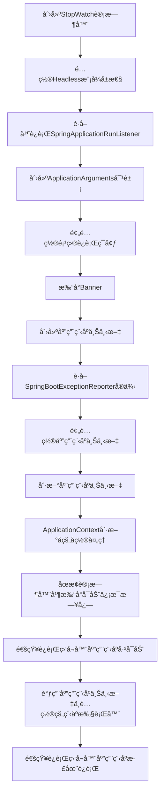

- [ ] JVM
  
  - [ ] 内存泄æ¼
    
    - [ ] 如何解决

NIO netty

spring cloud gateway

- gateway è·Ÿ sentinel 有什么区别, sentinel åŒæ ·å¯ä»¥åšåˆ°é™æµ,é™çº§

ElasticSearch

dubbo

oauth2

- oauth2 æˆæƒ

rabbitmq/RocketMQ

- 如何ä¿è¯MQ消æ¯ä¸ä¸¢å¤±

springboot ＋ vue

Spring Cloud Alibaba是一个基äºSpring Cloudçš„å¾®æœåŠ¡æ¡†æ¶ï¼Œå®ƒæ•´åˆäº†Alibaba的一些开æºç»„件，以æ供云åŸç”Ÿåº”用程åºçš„基础设施。以下是Spring Cloud Alibaba的一些核心组件：

1. Nacos：一个易äºä½¿ç”¨çš„ã€åŠŸèƒ½å¼ºå¤§çš„动æ€æœåŠ¡å‘ç°ã€é…置和æœåŠ¡ç®¡ç†å¹³å°ã€‚Nacoså¯ä»¥æ›¿ä»£Spring Cloud Eureka作为æœåŠ¡æ³¨å†Œå’Œå‘ç°ä¸­å¿ƒï¼ŒåŒæ—¶è¿˜æ供了分布å¼é…置管ç†åŠŸèƒ½ï¼Œç±»ä¼¼äºSpring Cloud Config。

2. Sentinel：一个轻é‡çº§çš„æµé‡æ§åˆ¶ã€ç†”断和系统负载ä¿æŠ¤ç»„件。Sentinelå¯ä»¥æ›¿ä»£Spring Cloud Hystrix作为æœåŠ¡é™çº§å’Œç†”断器å®ç°ï¼Œæ供更细粒度的æµé‡æ§åˆ¶ç­–略。

3. RocketMQ：一款高性能ã€å¯æ‰©å±•çš„消æ¯ä¸­é—´ä»¶ã€‚Spring Cloud Alibabaæ供了ä¸RocketMQçš„æ•´åˆï¼Œä½¿å¾—å¼€å‘者å¯ä»¥æ–¹ä¾¿åœ°å®ç°åˆ†å¸ƒå¼äº‹åŠ¡å’Œäº‹ä»¶é©±åŠ¨æ¶æ„。

4. Seata：一个分布å¼äº‹åŠ¡è§£å†³æ–¹æ¡ˆï¼Œæ”¯æŒATã€TCCã€SAGAå’ŒXA模å¼ã€‚Spring Cloud Alibabaæ供了Seataçš„æ•´åˆï¼Œå¸®åŠ©å¼€å‘者在微æœåŠ¡ç¯å¢ƒä¸­å®ç°åˆ†å¸ƒå¼äº‹åŠ¡ã€‚

5. Dubbo：一个高性能的RPC通信框æ¶ã€‚Spring Cloud Alibabaæ供了ä¸Dubboçš„æ•´åˆï¼Œä½¿å¾—å¼€å‘者å¯ä»¥ä½¿ç”¨åŸºäºDubboçš„æœåŠ¡é—´é€šä¿¡ï¼Œè€Œä¸ä»…仅是基äºHTTPçš„RESTful API。

6. Spring Cloud Alibaba OSS：一个ä¸é˜¿é‡Œäº‘对象存储æœåŠ¡ï¼ˆOSS）的整åˆç»„件，æ供了简å•çš„APIæ¥ä¸é˜¿é‡Œäº‘OSS进行交互，如上传ã€ä¸‹è½½ã€åˆ é™¤ç­‰æ“作。

7. Spring Cloud Alibaba SMS：一个ä¸é˜¿é‡Œäº‘短信æœåŠ¡ï¼ˆSMS）的整åˆç»„件，æ供了å‘é€çŸ­ä¿¡çš„简便方法。

8. Spring Cloud Alibaba SchedulerX：一个ä¸é˜¿é‡Œå·´å·´SchedulerX定时任务调度中心的整åˆç»„件，æ供了简å•çš„APIæ¥åˆ›å»ºã€æŸ¥è¯¢ã€æ›´æ–°å’Œåˆ é™¤å®šæ—¶ä»»åŠ¡ã€‚

通过使用Spring Cloud Alibaba，开å‘者å¯ä»¥åˆ©ç”¨Alibaba的一些核心组件æ¥æ„建云åŸç”Ÿåº”用程åºï¼ŒåŒæ—¶ä»ç„¶äº«æœ‰Spring Cloud所æ供的抽象和简化。这些组件å¯ä»¥å¸®åŠ©è§£å†³åˆ†å¸ƒå¼ç³»ç»Ÿä¸­çš„常è§é—®é¢˜ï¼Œå¦‚æœåŠ¡å‘ç°ã€é…置管ç†ã€è´Ÿè½½å‡è¡¡ã€ç†”æ–­å’Œé™çº§ç­‰ã€‚

---

- [x] 🕠juc 多线程  
- [x] 🚠 SQL  优化  
- [ ] 🟠JVM 入门/优化  
- [x] 🌭  zookeeper  
- [x] 🧂 spring cloud  
- [x] 🔠mysql  
- [x] 🕠spring 创建类 + 生命周期 + 循ç¯ä¾èµ– + Spring事件驱动模å‹(观察者模å¼)  
- [ ] B+ LSMæ ‘ 红黑树 ä½å›¾ https://blog.csdn.net/qq_39390545/article/details/108232888  
- [ ] 设计模å¼çš„六大åŸåˆ™ + 监å¬å™¨æ¨¡å¼ +  
- [ ] æ’åº å¿«é€Ÿæ’åº  
- [ ] redis åŸç† https://pdai.tech/md/db/nosql-redis/db-redis-overview.html  
- [ ] 🚗  æ¡åŠ›å™¨ > å·¦-0 å³-30  
- [x] java8 -> java17之间的å˜åŒ–ç‰¹å¾  
- [x] spring bean生命周期 + 循ç¯ä¾èµ– + spring webåŸç†  
- [ ] aop æ•´ç†ä¸€ä¸‹ä»@enableaspectJProxy -> 调用链 åŸç†  
- [x] PDF 阿里巴巴规范  
- [x] spring åŸç†, 我们ä»å“ªé‡Œè·³è¿›å»æˆ‘们的æºç å‘¢?  
- [x] æ•°æ®è„±æ•  
- [ ] springcloud é™æµ  
- [x] springboot webè¿”å› ResponseEntity  
- [x] idea调用æ¥å£  
- [ ] é”çš„ç§ç±», 如何å‡çº§  Sychronizedçš„é”å‡çº§è¿‡ç¨‹æ˜¯æ€æ ·çš„? https://www.yuque.com/renyong-jmovm/dadudu/prsemwubgm0n33qb  
- [x] spring  @ManageBean @Named @Lookup  
- [ ] API性能 - 代ç ä¼˜åŒ– - 如何监æ§æ¥å£è€—æ—¶, redis耗时, æ•°æ®åº“耗时  
- [x] 如何æ高项目å¯åŠ¨é€Ÿåº¦  
- [x] java中 <? extends T> <? super T>  
- [ ] 看完 JVM 之åå†ç»­å‰ç¼˜  å•æœºç‰ˆæˆ‘觉得  JConsole  JStack  远程å•æœºç‰ˆ  å¼€æºç”¨ VisualVM Arthas  有钱å¯ä»¥ç”¨ JProfiler  åˆ†å¸ƒå¼  Prometheus  Skywalking

*DevOps*（Developmentå’ŒOperationsçš„æ··æˆè©ï¼‰æ˜¯ä¸€ç§é‡è§†ã€Œè½¯ä»¶å¼€å‘人员（Dev）ã€å’Œã€ŒITè¿ç»´æŠ€æœ¯äººå‘˜ï¼ˆOps）ã€ä¹‹é—´æ²Ÿé€šåˆä½œçš„文化ã€è¿åŠ¨æˆ–慣例

Servlet容器

- Tomcat

Person: 

- 请帮我在springboot写一个 Redis 秒æ€æ¡ˆä¾‹

ChatGPT: 

- 好的，下é¢æ˜¯ä¸€ä¸ªç®€å•çš„Redis秒æ€æ¡ˆä¾‹ï¼ŒåŸºäºSpring Bootå®ç°ã€‚

首先，我们需è¦åœ¨pom.xml文件中添加以下ä¾èµ–，以使用Spring Bootå’ŒRedis：

```xml
<dependency>
  <groupId>org.springframework.boot</groupId>
  <artifactId>spring-boot-starter-web</artifactId>
</dependency>
<dependency>
  <groupId>org.springframework.boot</groupId>
  <artifactId>spring-boot-starter-data-redis</artifactId>
</dependency>
```

æ¥ç€ï¼Œæˆ‘们需è¦åœ¨application.properties中é…ç½®Redisè¿æ¥ä¿¡æ¯ï¼š

```properties
spring.redis.host=localhost
spring.redis.port=6379
spring.redis.password=
spring.redis.database=0
```

然å，我们需è¦ç¼–写一个Redis秒æ€æœåŠ¡ç±»ï¼Œå¦‚下所示：

```java
@Service
public class RedisSeckillService {

  @Autowired
  private RedisTemplate<String, Object> redisTemplate;

  /**
   * Redis秒æ€
   *
   * @param seckillId 秒æ€å•†å“ID
   * @param userId    用户ID
   * @param count     秒æ€æ•°é‡
   * @return 秒æ€ç»“æœ
   */
  public boolean seckill(long seckillId, long userId, int count) {
    String key = "seckill:" + seckillId;
    ValueOperations<String, Object> operations = redisTemplate.opsForValue();
    Long stock = operations.increment(key + ":stock", -count);
    if (stock < 0) {
      operations.increment(key + ":stock", count);
      return false;
    }
    operations.increment(key + ":sales", count);
    return true;
  }

}
```

在Redis秒æ€æœåŠ¡ç±»ä¸­ï¼Œæˆ‘们使用了RedisTemplateæ¥æ“作Redis，并å®ç°äº†ä¸€ä¸ªseckill()方法，用äºæ‰§è¡Œç§’æ€æ“作。在seckill()方法中，我们首先使用increment()方法æ¥å‡å°‘秒æ€å•†å“的库存，如æœåº“å­˜ä¸è¶³åˆ™è¿”å›false，å¦åˆ™å¢åŠ ç§’æ€å•†å“的销é‡å¹¶è¿”å›true。

最å，我们需è¦ç¼–写一个Controller类，用äºæ¥æ”¶ç§’æ€è¯·æ±‚，并调用Redis秒æ€æœåŠ¡ç±»æ¥æ‰§è¡Œç§’æ€æ“作，如下所示：

```java
@RestController
public class SeckillController {

  @Autowired
  private RedisSeckillService redisSeckillService;

  @PostMapping("/seckill")
  public String seckill(@RequestParam long seckillId, @RequestParam long userId, @RequestParam int count) {
    boolean result = redisSeckillService.seckill(seckillId, userId, count);
    if (result) {
      return "seckill success";
    } else {
      return "seckill failed";
    }
  }

}
```

在Controller类中，我们使用了@PostMapping注解æ¥æ¥æ”¶POST请求，并使用@RequestParam注解æ¥è·å–秒æ€å•†å“IDã€ç”¨æˆ·ID和秒æ€æ•°é‡ç­‰å‚数。æ¥ç€ï¼Œæˆ‘们调用Redis秒æ€æœåŠ¡ç±»çš„seckill()方法æ¥æ‰§è¡Œç§’æ€æ“作，并根æ®è¿”å›ç»“æœæ¥è¿”å›ç§’æ€ç»“æœã€‚

以上就是一个简å•çš„Redis秒æ€æ¡ˆä¾‹çš„å®ç°æ–¹å¼ï¼Œå¸Œæœ›å¯¹æ‚¨æœ‰æ‰€å¸®åŠ©ã€‚

Person: 

- 在秒æ€è¿‡ç¨‹ä¸­, 如何解决超å–的问题

ChatGPT: 

- 秒æ€è¿‡ç¨‹ä¸­ï¼Œè¶…å–是一个常è§çš„问题。在传统的关系å‹æ•°æ®åº“中，我们å¯ä»¥é€šè¿‡äº‹åŠ¡å’Œé”æ¥ä¿è¯ç§’æ€çš„åŸå­æ€§å’Œå¹¶å‘安全性。但是在Redis中，由äºRedis是å•çº¿ç¨‹çš„，无法使用é”和事务æ¥å®ç°ç§’æ€çš„并å‘æ§åˆ¶ï¼Œå› æ­¤éœ€è¦ä½¿ç”¨å…¶ä»–æ–¹å¼æ¥è§£å†³è¶…å–的问题。

以下是几ç§è§£å†³è¶…å–问题的方å¼ï¼š

1. 使用分布å¼é”

å¯ä»¥ä½¿ç”¨åˆ†å¸ƒå¼é”æ¥å®ç°ç§’æ€çš„并å‘æ§åˆ¶ã€‚在秒æ€å¼€å§‹æ—¶ï¼Œä½¿ç”¨åˆ†å¸ƒå¼é”é”ä½ç§’æ€å•†å“的库存，ä¿è¯åªæœ‰ä¸€ä¸ªç”¨æˆ·å¯ä»¥è¿›è¡Œç§’æ€æ“作。在秒æ€ç»“æŸå，释放分布å¼é”。

1. 使用Redis Lua脚本

Redis支æŒä½¿ç”¨Lua脚本æ¥æ‰§è¡ŒåŸå­æ“作，å¯ä»¥é€šè¿‡Lua脚本æ¥å®ç°ç§’æ€çš„åŸå­æ€§å’Œå¹¶å‘安全性。在秒æ€è¿‡ç¨‹ä¸­ï¼Œä½¿ç”¨Lua脚本æ¥å‡å°‘秒æ€å•†å“的库存，并判断库存是å¦è¶³å¤Ÿï¼Œå¦‚æœåº“å­˜ä¸è¶³åˆ™è¿”å›å¤±è´¥ã€‚

1. 使用令牌桶算法

å¯ä»¥ä½¿ç”¨ä»¤ç‰Œæ¡¶ç®—法æ¥é™åˆ¶ç§’æ€çš„并å‘数，ä¿è¯ç§’æ€çš„安全性。在秒æ€å¼€å§‹å‰ï¼Œä½¿ç”¨ä»¤ç‰Œæ¡¶ç®—法生æˆä¸€å®šæ•°é‡çš„令牌，并将这些令牌存储在Redis中。在用户进行秒æ€æ—¶ï¼Œä»Redis中è·å–一个令牌，如æœä»¤ç‰Œä¸è¶³åˆ™è¿”å›å¤±è´¥ã€‚

1. 基äºæ¶ˆæ¯é˜Ÿåˆ—的异步处ç†

å¯ä»¥ä½¿ç”¨æ¶ˆæ¯é˜Ÿåˆ—æ¥å®ç°ç§’æ€çš„异步处ç†ã€‚在用户进行秒æ€æ“作时，将秒æ€è¯·æ±‚å‘é€åˆ°æ¶ˆæ¯é˜Ÿåˆ—中，并在消æ¯é˜Ÿåˆ—中进行并å‘æ§åˆ¶ã€‚在消æ¯é˜Ÿåˆ—中消费秒æ€è¯·æ±‚，将请求转å‘给秒æ€æœåŠ¡è¿›è¡Œå¤„ç†ï¼Œä¿è¯ç§’æ€çš„åŸå­æ€§å’Œå¹¶å‘安全性。

这些方法都å¯ä»¥æœ‰æ•ˆåœ°è§£å†³ç§’æ€è¿‡ç¨‹ä¸­çš„超å–问题，选择åˆé€‚的方法å–决äºå…·ä½“的业务需求和系统æ¶æ„。

Person: 

- 说一下, 基äºæ¶ˆæ¯é˜Ÿåˆ—çš„å¼‚æ­¥å¤„ç† è¿™ç§æ–¹æ¡ˆ

ChatGPT: 

- 基äºæ¶ˆæ¯é˜Ÿåˆ—的异步处ç†æ–¹æ¡ˆæ˜¯ä¸€ç§æ¯”较常用的解决秒æ€è¶…å–问题的方案。在这ç§æ–¹æ¡ˆä¸­ï¼Œç§’æ€è¯·æ±‚先被å‘é€åˆ°æ¶ˆæ¯é˜Ÿåˆ—中，然å在消æ¯é˜Ÿåˆ—中进行异步处ç†ï¼Œä»¥è¾¾åˆ°å¹¶å‘æ§åˆ¶å’Œé˜²æ­¢è¶…å–的目的。

具体æ¥è¯´ï¼Œè¿™ç§æ–¹æ¡ˆä¸€èˆ¬åŒ…括以下几个步骤：

1. å‘é€ç§’æ€è¯·æ±‚到消æ¯é˜Ÿåˆ—

当用户进行秒æ€æ“作时，将秒æ€è¯·æ±‚å‘é€åˆ°æ¶ˆæ¯é˜Ÿåˆ—中。这里的消æ¯é˜Ÿåˆ—å¯ä»¥é€‰æ‹©å¤šç§æ¶ˆæ¯é˜Ÿåˆ—产å“，例如Kafkaã€RabbitMQã€ActiveMQ等。在å‘é€æ¶ˆæ¯æ—¶ï¼Œå¯ä»¥ä½¿ç”¨æ¶ˆæ¯é˜Ÿåˆ—的生产者API或者HTTPæ¥å£ç­‰æ–¹å¼ã€‚

1. 在消æ¯é˜Ÿåˆ—中进行并å‘æ§åˆ¶

在消æ¯é˜Ÿåˆ—中，å¯ä»¥ä½¿ç”¨å¤šç§æ–¹å¼è¿›è¡Œå¹¶å‘æ§åˆ¶ã€‚例如，å¯ä»¥ä½¿ç”¨æ¶ˆæ¯é˜Ÿåˆ—的队列长度æ¥é™åˆ¶å¹¶å‘数，也å¯ä»¥ä½¿ç”¨æ¶ˆè´¹è€…æ•°é‡æ¥é™åˆ¶å¹¶å‘数。åŒæ—¶ï¼Œè¿˜å¯ä»¥ä½¿ç”¨æ¶ˆæ¯é˜Ÿåˆ—çš„æ’队机制æ¥æ§åˆ¶è¯·æ±‚的处ç†é¡ºåºã€‚

1. 消费消æ¯å¹¶å¤„ç†ç§’æ€è¯·æ±‚

在消æ¯é˜Ÿåˆ—中，消费者ä»é˜Ÿåˆ—中è·å–秒æ€è¯·æ±‚并进行处ç†ã€‚在处ç†è¯·æ±‚时，å¯ä»¥ä½¿ç”¨ä¸€äº›æŠ€æœ¯æ¥ä¿è¯å¹¶å‘安全性和防止超å–。例如，在处ç†è¯·æ±‚时，å¯ä»¥ä½¿ç”¨Redisçš„åŸå­æ“作æ¥ä¿è¯åº“存的å‡å°‘是åŸå­çš„。åŒæ—¶ï¼Œå¯ä»¥ä½¿ç”¨Redis的分布å¼é”æ¥ä¿è¯åŒä¸€æ—¶åˆ»åªæœ‰ä¸€ä¸ªæ¶ˆè´¹è€…在处ç†è¯·æ±‚。

1. è¿”å›ç§’æ€ç»“æœ

处ç†å®Œç§’æ€è¯·æ±‚å，将秒æ€ç»“æœè¿”å›ç»™ç”¨æˆ·ã€‚这里的结æœå¯ä»¥åŒ…括秒æ€æˆåŠŸæˆ–失败等信æ¯ã€‚

基äºæ¶ˆæ¯é˜Ÿåˆ—的异步处ç†æ–¹æ¡ˆå¯ä»¥æœ‰æ•ˆåœ°è§£å†³ç§’æ€è¶…å–问题，åŒæ—¶è¿˜å¯ä»¥æ高系统的并å‘处ç†èƒ½åŠ›ã€‚但是这ç§æ–¹æ¡ˆéœ€è¦ä¾èµ–消æ¯é˜Ÿåˆ—产å“，å¢åŠ äº†ç³»ç»Ÿçš„å¤æ‚度。åŒæ—¶ï¼Œç”±äºæ¶ˆæ¯é˜Ÿåˆ—本身具有一定的延迟性，å¯èƒ½ä¼šå½±å“用户体验。因此，在选择这ç§æ–¹æ¡ˆæ—¶éœ€è¦æ ¹æ®å…·ä½“的业务需求进行æƒè¡¡å’Œé€‰æ‹©ã€‚

Person: 

- 在消æ¯é˜Ÿåˆ—中进行并å‘æ§åˆ¶, 这个具体说一下

ChatGPT: 

- 在消æ¯é˜Ÿåˆ—中进行并å‘æ§åˆ¶ï¼Œå¯ä»¥é‡‡ç”¨å¤šç§æ–¹å¼ï¼Œå¸¸è§çš„æ–¹å¼åŒ…括以下几ç§ï¼š
1. 队列长度æ§åˆ¶å¹¶å‘æ•°

è¿™ç§æ–¹å¼æ˜¯æœ€ç®€å•ã€æœ€å¸¸è§çš„æ–¹å¼ã€‚å³é€šè¿‡é™åˆ¶æ¶ˆæ¯é˜Ÿåˆ—中的消æ¯æ•°é‡ï¼Œæ¥æ§åˆ¶å¹¶å‘处ç†çš„请求数é‡ã€‚当队列中的消æ¯æ•°é‡è¾¾åˆ°ä¸€å®šçš„上é™æ—¶ï¼Œå°±ä¼šåœæ­¢æ¥æ”¶æ–°çš„请求。这ç§æ–¹å¼çš„优点是简å•æ˜“用，但是需è¦æ ¹æ®ç³»ç»Ÿçš„负载和处ç†é€Ÿåº¦æ¥è®¾ç½®é˜Ÿåˆ—长度上é™ï¼Œä¸æ˜“调整和优化。

1. 消费者数é‡æ§åˆ¶å¹¶å‘æ•°

è¿™ç§æ–¹å¼æ˜¯é€šè¿‡è®¾ç½®æ¶ˆè´¹è€…çš„æ•°é‡æ¥æ§åˆ¶å¹¶å‘处ç†çš„请求数é‡ã€‚当有新的请求进入消æ¯é˜Ÿåˆ—时，会自动被分é…给一个空闲的消费者进行处ç†ã€‚如æœæ‰€æœ‰æ¶ˆè´¹è€…都处äºå¿™ç¢ŒçŠ¶æ€ï¼Œåˆ™æ–°çš„请求会等待直到有消费者空闲为止。这ç§æ–¹å¼çš„优点是å¯ä»¥æ ¹æ®ç³»ç»Ÿè´Ÿè½½æƒ…况自动调整消费者数é‡ï¼Œä½†æ˜¯éœ€è¦è€ƒè™‘消费者数é‡è¿‡å¤šå¯èƒ½ä¼šå¸¦æ¥çš„系统开销和负载问题。

1. 消æ¯ä¼˜å…ˆçº§æ§åˆ¶å¹¶å‘æ•°

è¿™ç§æ–¹å¼æ˜¯é€šè¿‡è®¾ç½®æ¶ˆæ¯çš„优先级æ¥æ§åˆ¶å¹¶å‘处ç†çš„请求数é‡ã€‚在消æ¯é˜Ÿåˆ—中，å¯ä»¥ç»™æ¯ä¸ªæ¶ˆæ¯è®¾ç½®ä¸€ä¸ªä¼˜å…ˆçº§ï¼Œä¼˜å…ˆçº§é«˜çš„消æ¯ä¼šè¢«å…ˆå¤„ç†ã€‚通过设置消æ¯ä¼˜å…ˆçº§ï¼Œå¯ä»¥ä¿è¯é«˜ä¼˜å…ˆçº§çš„请求先被处ç†ï¼Œä»è€Œæœ‰æ•ˆæ§åˆ¶å¹¶å‘处ç†çš„请求数é‡ã€‚è¿™ç§æ–¹å¼çš„优点是å¯ä»¥ä¼˜å…ˆå¤„ç†ç´§æ€¥çš„请求，但是需è¦åœ¨ç³»ç»Ÿè®¾è®¡æ—¶è€ƒè™‘优先级的分é…和调整策略。

1. é™æµç®—法æ§åˆ¶å¹¶å‘æ•°

è¿™ç§æ–¹å¼æ˜¯é€šè¿‡ä¸€å®šçš„算法对请求进行é™æµï¼Œæ§åˆ¶è¯·æ±‚的处ç†é€Ÿåº¦å’Œå¹¶å‘æ•°é‡ã€‚常è§çš„é™æµç®—法包括令牌桶算法ã€æ¼æ¡¶ç®—法等。通过é™æµç®—法，å¯ä»¥æœ‰æ•ˆåœ°æ§åˆ¶ç³»ç»Ÿçš„并å‘处ç†èƒ½åŠ›ï¼Œé˜²æ­¢è¶…负载和系统崩溃。但是需è¦åœ¨ç®—法选择和å‚数设置上进行一定的优化和调整。

以上是常è§çš„在消æ¯é˜Ÿåˆ—中进行并å‘æ§åˆ¶çš„æ–¹å¼ï¼Œæ ¹æ®å…·ä½“的业务需求和系统æ¶æ„，å¯ä»¥é€‰æ‹©åˆé€‚çš„æ–¹å¼è¿›è¡Œå®ç°ã€‚

Person: 

- 说一下 é™æµç®—法æ§åˆ¶å¹¶å‘æ•°

ChatGPT: 

- é™æµç®—法是一ç§é€šè¿‡é™åˆ¶æµé‡æˆ–请求的速ç‡ï¼Œæ¥ä¿æŠ¤ç³»ç»Ÿå…å—过载的攻击或者自身处ç†é€Ÿåº¦çš„é™åˆ¶çš„一ç§æ–¹å¼ã€‚在æ§åˆ¶å¹¶å‘æ•°æ–¹é¢ï¼Œå¸¸è§çš„é™æµç®—法有令牌桶算法和æ¼æ¡¶ç®—法。
1. 令牌桶算法

令牌桶算法是一ç§åŸºäºä»¤ç‰Œçš„算法，它的基本æ€æƒ³æ˜¯ç»´æŠ¤ä¸€ä¸ªå›ºå®šå®¹é‡çš„桶，桶中存放ç€å›ºå®šæ•°é‡çš„令牌，æ¯å½“有一个请求到æ¥æ—¶ï¼Œå°±éœ€è¦è·å–一个令牌，如æœæ¡¶ä¸­æœ‰è¶³å¤Ÿçš„令牌，则å…许请求通过，å¦åˆ™è¯·æ±‚被拒ç»ã€‚

在令牌桶算法中，令牌以一定的速ç‡è¢«æ·»åŠ åˆ°æ¡¶ä¸­ï¼Œå¦‚æœæ¡¶å·²ç»æ»¡äº†ï¼Œé‚£ä¹ˆä»¤ç‰Œå°±è¢«ä¸¢å¼ƒã€‚这样å¯ä»¥ä¿è¯æ¡¶ä¸­æœ€å¤šåªæœ‰ä¸€å®šæ•°é‡çš„令牌，ä»è€Œæ§åˆ¶è¯·æ±‚的速ç‡ã€‚

1. æ¼æ¡¶ç®—法

æ¼æ¡¶ç®—法是一ç§åŸºäºæ¼æ¡¶çš„算法，它的基本æ€æƒ³æ˜¯ç»´æŠ¤ä¸€ä¸ªå›ºå®šå®¹é‡çš„æ¼æ¡¶ï¼Œæ¯å½“有一个请求到æ¥æ—¶ï¼Œå°±éœ€è¦å‘æ¼æ¡¶ä¸­æ·»åŠ ä¸€ä¸ªè¯·æ±‚，æ¼æ¡¶ä»¥ä¸€å®šçš„速ç‡å°†è¯·æ±‚æ’出，如æœæ¼æ¡¶ä¸ºç©ºï¼Œåˆ™è¯·æ±‚被拒ç»ã€‚

在æ¼æ¡¶ç®—法中，请求被添加到æ¼æ¡¶ä¸­å，æ¯éš”一定的时间，æ¼æ¡¶ä¼šæ’出一定数é‡çš„请求，ä»è€Œæ§åˆ¶è¯·æ±‚的速ç‡ã€‚ä¸ä»¤ç‰Œæ¡¶ç®—法ä¸åŒçš„是，æ¼æ¡¶ç®—法å¯ä»¥åœ¨è¯·æ±‚过多的情况下进行缓存，一定程度上缓解请求的å‹åŠ›ã€‚

在å®é™…的应用中，å¯ä»¥æ ¹æ®å…·ä½“的业务需求和系统负载情况æ¥é€‰æ‹©é€‚åˆçš„é™æµç®—法。例如，在高并å‘的场景中，令牌桶算法通常比较适åˆï¼Œè€Œåœ¨è¯·æ±‚速ç‡è¾ƒä¸ºå¹³ç¨³çš„场景中，æ¼æ¡¶ç®—法å¯èƒ½æ›´åŠ åˆé€‚。åŒæ—¶ï¼Œéœ€è¦æ ¹æ®ç³»ç»Ÿçš„负载情况和性能è¦æ±‚，对算法的å‚数进行åˆç†çš„调整和优化。

Person: 

- 说一下基äºæ¶ˆæ¯é˜Ÿåˆ—的异步处ç†ä¸­çš„消费消æ¯å¹¶å¤„ç†ç§’æ€è¯·æ±‚, 说一下为什么需è¦Redis的分布å¼é”æ§åˆ¶è¯·æ±‚

ChatGPT: 

- 在基äºæ¶ˆæ¯é˜Ÿåˆ—的异步处ç†ä¸­ï¼Œæ¶ˆè´¹è€…ä»é˜Ÿåˆ—中è·å–秒æ€è¯·æ±‚并进行处ç†ã€‚在处ç†è¯·æ±‚时，å¯èƒ½ä¼šé‡åˆ°å¹¶å‘处ç†çš„问题，因为多个消费者å¯èƒ½åŒæ—¶è·å–到åŒä¸€æ¡ç§’æ€è¯·æ±‚，导致é‡å¤å¤„ç†æˆ–者处ç†å¤±è´¥ã€‚

为了é¿å…è¿™ç§æƒ…况的å‘生，需è¦åœ¨å¤„ç†è¯·æ±‚时进行并å‘æ§åˆ¶ã€‚其中，使用分布å¼é”是一ç§æ¯”较常è§çš„并å‘æ§åˆ¶æ–¹å¼ï¼Œå¯ä»¥ä¿è¯åŒä¸€æ—¶åˆ»åªæœ‰ä¸€ä¸ªæ¶ˆè´¹è€…在处ç†è¯·æ±‚。

在Redis中，分布å¼é”通常使用Redlock算法å®ç°ï¼Œå³åˆ©ç”¨Redisçš„åŸå­æ€§æ“作和过期时间设置æ¥å®ç°åˆ†å¸ƒå¼é”。Redlock算法的基本æ€æƒ³æ˜¯ï¼šä½¿ç”¨å¤šä¸ªRediså®ä¾‹ï¼Œæ¯ä¸ªå®ä¾‹è·å–分布å¼é”的过程分为三个步骤，å³è·å–当å‰æ—¶é—´ã€å°è¯•è·å–é”ã€æ ¹æ®è·å–é”的时间计算é”的过期时间并设置。

如æœå¤šä¸ªæ¶ˆè´¹è€…åŒæ—¶å°è¯•è·å–é”，åªæœ‰è·å–到é”çš„å®ä¾‹æ‰èƒ½å¯¹è¯·æ±‚进行处ç†ï¼Œå…¶ä»–å®ä¾‹åˆ™ç­‰å¾…é”释放åå†æ¬¡å°è¯•è·å–é”。通过使用Redlock算法，å¯ä»¥é¿å…é”ç«äº‰çš„问题，ä¿è¯åŒä¸€æ—¶åˆ»åªæœ‰ä¸€ä¸ªæ¶ˆè´¹è€…在处ç†è¯·æ±‚。

åŒæ—¶ï¼Œéœ€è¦æ³¨æ„的是，Redis的分布å¼é”虽然能够解决并å‘æ§åˆ¶çš„问题，但是也å¯èƒ½ä¼šå¸¦æ¥ä¸€å®šçš„性能开销和系统å¤æ‚度。因此，在使用分布å¼é”时需è¦æ ¹æ®å…·ä½“的业务需求和系统情况进行æƒè¡¡å’Œé€‰æ‹©ã€‚

Jenkins 的文章, 帮我总结一下  

文章链æ¥: [1.7Wå­—Jenkinsä¿å§†çº§æ•™ç¨‹ (qq.com)](https://mp.weixin.qq.com/s/N8CHQbMvr6mdVXMoR7uItQ)  

# Jenkins ä¿å§†çº§æ•™ç¨‹æ¦‚è¿°

欢è¿æ¥åˆ° Jenkins ä¿å§†çº§æ•™ç¨‹æ¦‚è¿°ï¼è¿™é‡Œå°†ä¸ºå¤§å®¶æ€»ç»“ä¸€ä¸‹å…³äº Jenkins çš„ä¿å§†çº§æ•™ç¨‹ï¼Œå†…容丰富，涵盖ä»å…¥é—¨åˆ°è¿›é˜¶ï¼Œè®©ä½ è½»æ¾æˆä¸º Jenkins 大师。我们将以轻æ¾å¹½é»˜çš„æ–‡é£ä¸ºå¤§å®¶è®²è§£ Jenkins çš„å„个方é¢ã€‚那么，我们就开始å§ï¼  

## 一ã€Jenkins 介ç»åŠå®‰è£…

Jenkins，一ä½å—人尊敬的æŒç»­é›†æˆç®¡å®¶ï¼Œå¯ä»¥å¸®åŠ©æˆ‘们自动化æ„建ã€æµ‹è¯•å’Œéƒ¨ç½²é¡¹ç›®ã€‚想è¦è¯·è¿™ä½ç®¡å®¶å…¥é©»ä½ çš„电脑，首先需è¦å®‰è£… Jenkins。根æ®å®˜æ–¹æ–‡æ¡£ï¼Œé€‰æ‹©é€‚åˆä½ çš„æ“作系统（Linuxã€Windows 或 macOS），跟ç€æ­¥éª¤ä¸€æ­¥æ­¥å®‰è£…。安装完æˆå，Jenkins å°±å¯ä»¥å¼€å§‹ä¸ºä½ æœåŠ¡å•¦ï¼  

## 二ã€æ’件的世界

Jenkins çš„æ’件系统就åƒæ˜¯ä¸€ä¸ªå¤§å‹çš„超市，ç³ç…满目，有å„ç§å„æ ·çš„æ’件供你挑选。通过安装åˆé€‚çš„æ’件，Jenkins å¯ä»¥ä¸ºä½ å®Œæˆå„ç§ä»»åŠ¡ã€‚这里æ¨è一些常用的æ’件，例如 Gitã€Pipelineã€Docker 等。当然，åƒä¸‡ä¸è¦è´ªå¤šå“¦ï¼åªé€‰æ‹©ä½ éœ€è¦çš„æ’件，ä¿æŒ Jenkins çš„è½»é‡çº§è¿è¡Œã€‚  

## 三ã€Jenkins 任务创建

邀请 Jenkins 管家æ¥åˆ°ä½ çš„电脑å，æ¥ä¸‹æ¥å°±æ˜¯æ•™ä¼šå®ƒå¦‚何帮助你管ç†é¡¹ç›®ã€‚在 Jenkins 中，我们å¯ä»¥åˆ›å»ºå„ç§ä»»åŠ¡ã€‚任务的创建就åƒæ˜¯ç¼–写一份详细的工作说æ˜ä¹¦ï¼Œå‘Šè¯‰ Jenkins 该如何执行任务。创建任务时，我们å¯ä»¥é€‰æ‹©ä¸åŒçš„任务类å‹ï¼Œä¾‹å¦‚自由é£æ ¼ã€æµæ°´çº¿ç­‰ã€‚  

## å››ã€æŒç»­é›†æˆï¼šè§‚察ä¸è¡ŒåŠ¨

æŒç»­é›†æˆæ˜¯ Jenkins 的核心功能，它会时刻关注代ç ä»“库的动æ€ã€‚æ¯å½“有新的代ç æ交，Jenkins 就会自动触å‘æ„建，进行编译ã€æµ‹è¯•ç­‰æ“作。这就好比一个警觉的看门狗，时刻关注ç€å®¶é‡Œçš„动é™ï¼Œç¡®ä¿ä¸€åˆ‡éƒ½åœ¨æŒæ§ä¹‹ä¸­ã€‚  

## 五ã€æ„建触å‘器

æƒ³è¦ Jenkins æˆä¸ºä½ çš„得力助手，你需è¦å‘Šè¯‰å®ƒä»€ä¹ˆæ—¶å€™å¼€å§‹è¡ŒåŠ¨ã€‚æ„建触å‘器就是这个时机的信å·ã€‚常è§çš„æ„建触å‘器包括代ç æ交ã€å®šæ—¶æ„建等。é…置好æ„建触å‘器å，Jenkins 会在适当的时候自动执行任务。  

## å…­ã€æµæ°´çº¿ï¼šé¡¹ç›®çš„生命周期

æµæ°´çº¿æ˜¯ Jenkins çš„å¦ä¸€ä¸ªé‡è¦åŠŸèƒ½ã€‚ 它就åƒæ˜¯ä¸€ä¸ªç²¾å¿ƒè®¾è®¡çš„生产线，负责管ç†é¡¹ç›®çš„整个生命周期。通过编写简å•çš„脚本，我们å¯ä»¥å®šä¹‰é¡¹ç›®çš„æ„建ã€æµ‹è¯•å’Œéƒ¨ç½²è¿‡ç¨‹ã€‚这让我们的项目更加规范化，æ高了开å‘效ç‡ã€‚  

## 七ã€åˆ†å¸ƒå¼æ„建：分而治之

有时候，一个项目å¯èƒ½éœ€è¦åœ¨ä¸åŒçš„ç¯å¢ƒä¸­æ„建和测试。Jenkins 支æŒåˆ†å¸ƒå¼æ„建，就åƒæ˜¯ä¸€ä¸ªé«˜æ•ˆçš„组织者，将æ„建任务分é…ç»™ä¸åŒçš„æ„建代ç†ï¼ˆbuild agent）完æˆã€‚这样，我们å¯ä»¥ç¡®ä¿é¡¹ç›®åœ¨å„个ç¯å¢ƒä¸­éƒ½èƒ½é¡ºåˆ©è¿è¡Œã€‚  

## å…«ã€å‚数化æ„建：çµæ´»åº”对

在ç°å®ç”Ÿæ´»ä¸­ï¼Œæˆ‘们ç»å¸¸éœ€è¦çµæ´»åº”对å„ç§æƒ…况。åŒæ ·ï¼ŒJenkins 也需è¦è¿™æ ·çš„能力。å‚数化æ„建就是这样一ç§èƒ½åŠ›ï¼Œå…许我们在è¿è¡Œæ„建时传入一些å‚数。这样，我们å¯ä»¥æ ¹æ®ä¸åŒåœºæ™¯è°ƒæ•´æ„建过程，满足å„ç§éœ€æ±‚。  

## ä¹ã€æŒç»­éƒ¨ç½²ï¼šè‡ªåŠ¨ä¸Šçº¿

æŒç»­éƒ¨ç½²æ˜¯ Jenkins çš„å¦ä¸€ä¸ªå¼ºå¤§åŠŸèƒ½ã€‚当项目ç»è¿‡æ„建和测试å，Jenkins 会自动将项目部署到预设ç¯å¢ƒä¸­ï¼Œè®©æµ‹è¯•äººå‘˜æˆ–客户å¯ä»¥éšæ—¶ä½“验。这就åƒæ˜¯ä¸€ä¸ªå¿«é€Ÿçš„快递员，将你的æˆæœåŠæ—¶é€è¾¾ç›®çš„地。  

## åã€å®‰å…¨ä¸æƒé™ï¼šä¿é©¾æŠ¤èˆª

在使用 Jenkins 的过程中，我们需è¦æ³¨æ„安全和æƒé™ç®¡ç†ã€‚为ä¸åŒçš„用户分é…适当的æƒé™ï¼Œé˜²æ­¢è¯¯æ“作或滥用æƒé™ã€‚åŒæ—¶ï¼Œå®šæœŸæ£€æŸ¥å’Œæ›´æ–°æ’件，确ä¿ç³»ç»Ÿçš„稳定è¿è¡Œã€‚  

## å一ã€æ€»ç»“ä¸å±•æœ›

通过本篇ä¿å§†çº§æ•™ç¨‹æ¦‚述，相信大家对 Jenkins 有了更深入的了解。æŒæ¡äº†è¿™ä¸ªå¼ºå¤§çš„æŒç»­é›†æˆå·¥å…·ï¼Œä½ å°†åœ¨å¼€å‘过程中游刃有余，大大æ高工作效ç‡ã€‚当然，Jenkins 的世界还有更多奥妙等待你å»æ¢ç´¢ã€‚希望你在 Jenkins çš„é“路上越走越远，æˆä¸º Jenkins çš„å¿ å®æ‹¥è¶¸ï¼

ç°åœ¨æœ‰ä¸€ä¸ªéœ€æ±‚, 我想æ­å»ºä¸€ä¸ªç‹¬ç«‹è¿è¡Œçš„ http 请求的模拟桩项目, åŒæ—¶æ‹¥æœ‰å¯è§†åŒ–ç•Œé¢, 用äºæ¨¡æ‹Ÿç”¨æˆ·å‘é€çš„请求, ç°åœ¨ä½ æ˜¯ä¸€ä¸ªé«˜çº§çš„ITæ¶æ„师, ä¸é™ä»»ä½•ç¼–程语言, 请你告诉我有哪些方案å¯ä»¥ç›´æ¥å®ç°http模拟请求å¯è§†åŒ–é…置的模拟桩项目?

[å•å…ƒæµ‹è¯• - Junit5 详解 | Java 全栈知识体系 (pdai.tech)](https://pdai.tech/md/develop/protocol/dev-protocol-network-basic.html)

junit 5 动æ€æµ‹è¯•åˆ°åº•è§£å†³äº†ä»€ä¹ˆé—®é¢˜

动æ€æµ‹è¯•é€‚用äºä»¥ä¸‹åœºæ™¯ï¼š  

1. 当测试数æ®é‡è¾ƒå¤§æ—¶ï¼Œä½¿ç”¨åŠ¨æ€æµ‹è¯•å¯ä»¥å‡å°‘测试方法的数é‡ã€‚  
2. 当测试数æ®éœ€è¦ä»å¤–部æ¥æºï¼ˆå¦‚æ•°æ®åº“ã€æ–‡ä»¶æˆ– API）è·å–时，动æ€æµ‹è¯•å¯ä»¥åœ¨è¿è¡Œæ—¶ç”Ÿæˆç›¸åº”的测试用例。  
3. 当需è¦æ ¹æ®æŸäº›æ¡ä»¶ç”Ÿæˆæµ‹è¯•ç”¨ä¾‹æ—¶ï¼ŒåŠ¨æ€æµ‹è¯•å¯ä»¥æ供更高的çµæ´»æ€§ã€‚

总感觉这些é™æ€çš„测试就å¯ä»¥åšåˆ°å‘€...

### ä¸å¯å˜çš„好处

**1. å¯ä»¥ç¼“å­˜ hash 值**

因为 String çš„ hash 值ç»å¸¸è¢«ä½¿ç”¨ï¼Œä¾‹å¦‚ String ç”¨åš HashMap çš„ key。ä¸å¯å˜çš„特性å¯ä»¥ä½¿å¾— hash 值也ä¸å¯å˜ï¼Œå› æ­¤åªéœ€è¦è¿›è¡Œä¸€æ¬¡è®¡ç®—。

**2. String Pool 的需è¦**

如æœä¸€ä¸ª String 对象已ç»è¢«åˆ›å»ºè¿‡äº†ï¼Œé‚£ä¹ˆå°±ä¼šä» String Pool 中å–得引用。åªæœ‰ String 是ä¸å¯å˜çš„，æ‰å¯èƒ½ä½¿ç”¨ String Pool。


**3. 安全性**

String ç»å¸¸ä½œä¸ºå‚数，String ä¸å¯å˜æ€§å¯ä»¥ä¿è¯å‚æ•°ä¸å¯å˜ã€‚例如在作为网络è¿æ¥å‚æ•°çš„æƒ…å†µä¸‹å¦‚æœ String 是å¯å˜çš„，那么在网络è¿æ¥è¿‡ç¨‹ä¸­ï¼ŒString 被改å˜ï¼Œæ”¹å˜ String 对象的那一方以为ç°åœ¨è¿æ¥çš„是其它主机，而å®é™…情况å´ä¸ä¸€å®šæ˜¯ã€‚

**4. 线程安全**

String ä¸å¯å˜æ€§å¤©ç”Ÿå…·å¤‡çº¿ç¨‹å®‰å…¨ï¼Œå¯ä»¥åœ¨å¤šä¸ªçº¿ç¨‹ä¸­å®‰å…¨åœ°ä½¿ç”¨ã€‚

---

OutOfMemoryError：内存ä¸è¶³é”™è¯¯ï¼›StackOverflowError：栈溢出错误

Virtual MachineError（虚拟机è¿è¡Œé”™è¯¯

当方法的调用者无力处ç†è¯¥å¼‚常的时候，应该继续抛出，而ä¸æ˜¯å›«å›µåæ£ã€‚

æ€ä¹ˆåˆ¤æ–­æ˜¯å¦æœ‰èƒ½åŠ›è§£å†³å¼‚常

å…³äºå¦‚何æ高é¢è¯•é€šè¿‡ç‡

- [ ] 优化在线简å†

- [ ] 自我介ç»

- [ ] 引导é¢è¯•å®˜, 自己擅长的 

今日

- [ ] 红黑树

- [ ] 线程有哪几ç§çŠ¶æ€? 分别说æ˜ä»ä¸€ç§çŠ¶æ€åˆ°å¦ä¸€ç§çŠ¶æ€è½¬å˜æœ‰å“ªäº›æ–¹å¼?

- [ ] JVM中é”的优化 [关键字: synchronized详解 | Java 全栈知识体系 (pdai.tech)](https://pdai.tech/md/java/thread/java-thread-x-key-synchronized.html) é”å‡çº§?

- [ ] 你画我猜

让gpt猜动物 猜æˆè¯­

生æˆæ€ç»´å¯¼å›¾

优化简å†

1. - [ ] åšä¸€ä¸ªç‰¹è‰²çš„自我介ç», æ¯å¤©æ—©ä¸Šæ™šä¸Šç¡è§‰éƒ½å¯¹ç€é•œå­ç»ƒä¹ ä¸€é

2. - [ ] 优化简å†ç•Œé¢

3. - [ ] 优化简å†ä¸Šçš„项目

4. - [ ] æ•´ç†bossç›´è˜ä¸Šçš„简å†

[程åºå‘˜å¿…懂的GC知识：ä»æœ¬è´¨è°ˆèµ·ï¼Œåªè¦å†¯è¯ºä¾æ›¼è®¡ç®—机体系存在，这个æµç¨‹å°±æ°¸è¿œä¸å˜ï¼_哔哩哔哩_bilibili](https://www.bilibili.com/video/BV1S34y1m7sX?p=35&vd_source=eabc2c22ae7849c2c4f31815da49f209)

父å­çº¿ç¨‹ä¹‹é—´ä¼ é€’ traceID

LocalThread 传递ä¸è¿‡å», 阿里å¯ä»¥

记录整个项目请求的耗时, 包括数æ®åº“/redis

QConã€ArchSummit

é“ æ°´å£¶

用一年时间æå‡è‡ªå·±

生活篇：

1ã€ä¸å†ç†¬å¤œï¼ˆæ—©èµ·å–æ¯æ¸©æ°´ï¼‰

2ã€ä¸‰é¤è§„律（饮食å清淡，多å–汤）

3ã€å¤šåƒæ°´æœï¼ˆè¡¥å……维生素）

4ã€æ¯å¤©å…«æ¯æ°´ï¼ˆå¤šç»™çš®è‚¤è¡¥æ°´ï¼‰

5ã€æ¯å‘¨æ³¡è„š2—3次（艾è‰æ³¡è„šæ’毒）

6ã€æ¯å‘¨è¿åŠ¨2—3次（包括练普拉æã€ç‘œä¼½

7ã€é€‚当化淡妆

（åšæŒæŠ¤è‚¤ï¼‰

8ã€å­¦ä¼šç©¿æ­ï¼ˆè¡£ç€æ•´æ´å¹²å‡€ï¼‰

9ã€æ¯å¤©çœ‹ä¹¦åŠå°æ—¶ï¼ˆæˆ–å¬ä¹¦ã€çœ‹å’¨è¯¢ï¼‰

10ã€æ¯å¤©æœ‰è®¡åˆ’（æ¯æ—¥å¤ç›˜æ€»ç»“）

11ã€æ¯å‘¨2次扫除（断èˆç¦»ä¸ç”¨çš„东西）

12ã€æ˜å¤©åšçš„事写进备忘录

13ã€ç†æƒ³æ¶ˆè´¹ï¼ˆä¸éšæ³¢é€æµï¼‰

14ã€å‡å°‘翘二éƒè…¿çš„习惯（ä¸å«èƒ¸é©¼èƒŒ

15ã€æŠ—糖（少å–奶茶，少åƒç”œå“）

个人æˆé•¿ç¯‡

1ã€æ¯å‘¨ç»ƒå­—（时间少时练一页就好）

2ã€ä¿æŒçœ‹ä¹¦çš„习惯（记录书中好的语录）

3ã€å¤šçœ‹çºªå½•ç‰‡ï¼ˆæˆ–者有益的å†å²ç”µè§†å‰§ï¼‰

4ã€å¤šéšç¬”（练自己文笔和写作能力）

5ã€çœ‹å®Œæ”¶è—çš„16个TED的演讲

6ã€æå‡ç†è´¢èƒ½åŠ›ï¼ˆã€Šç©·çˆ¸çˆ¸å¯Œçˆ¸çˆ¸ç³»åˆ—》

7ã€å¤šæ¥è§¦å¿ƒç†å­¦ï¼ˆä¹¦ç±åå®è·µï¼‰

8ã€ä¸æ©é¥°è‡ªå·±æ¬²æœ›ï¼ˆå»è¿½æ±‚ã€å»çªç ´ï¼‰

9ã€æå‡å£æ‰ï¼ˆä¹Ÿå¤šæå‡è‡ªå·±çš„情商）

10ã€åšæŒå­¦è‹±è¯­ï¼ˆä¸ºä»¥å出国读MBA准备

11ã€å®¡è§†è‡ªå·±è¿‡å»çš„能力（å»èœ•å˜å»è¿›åŒ–

12ã€æ高收入（多åšå‡ ä¸ªå‰¯ä¸šï¼‰

13ã€åŸ¹å…»è‡ªå·±çš„è€å¿ƒï¼ˆä»å…‹åˆ¶è¡¨è¾¾æ¬²å¼€å§‹

14ã€æ— è§†ä»–人看法和眼色（人生是自己的

15ã€å­¦ä¼šè®°è´¦ï¼ˆå®šæœŸå­˜é’±ï¼‰

16ã€å­¦ä¼šå¤šå¹³å°è¿è¥ï¼ˆå†™è½¯æ–‡ï¼‰

17ã€æŠŠâ€œæƒ³åšâ€å˜æˆâ€œæ­£åœ¨è¿›è¡Œâ€

18ã€å¤šå­¦ä¸ªæ–°æŠ€èƒ½ï¼ˆè´¢åŠ¡ã€å‰ªè¾‘等）

19ã€å­¦ä¼šæƒ…绪管ç†ï¼ˆå‹¿æŠŠå–œæ€’å“€ä¹æŒ‚脸上

20ã€ä¿æŒè‡ªå·±çš„兴趣爱好（沉浸其中åšå¥½

人际交往篇

1ã€å­¦ä¼šæ‹’ç»ï¼ˆæ•¢äºè¯´â€œä¸â€ï¼‰

2ã€å¯¹å¾®ä¿¡æœ‹å‹åœˆä¸å–œæ¬¢çš„人（断èˆç¦»ï¼‰

3ã€å‡å°‘无效社交（学会独处）

4ã€å’Œèº«è¾¹å¥½å‹ä¿æŒè”系（å¶å°”è§é¢ï¼‰

5ã€å¤šå’Œå®¶äººè”系（常打电è¯å›å®¶é—®å€™ï¼‰

6ã€å­¦ä¼šå°‘说（多倾å¬ï¼‰

7ã€å­¦ä¼šå¯Ÿè¨€è§‚色（哪些该说，哪些ä¸è¯¥è¯´

8ã€ä¸å¹²æ¶‰åˆ«äººçš„情感（ç§äº‹ã€å®¶äº‹ï¼‰

9ã€å¤šäººä¸€èµ·èšæ—¶ï¼ˆå¤šå…³ç…§è½å•çš„人）

10ã€å¤šå¤¸åˆ«äººçš„优点（少指责别人的缺点

11ã€ä¸åšè´¹åŠ›ä¸è®¨å¥½çš„事（少言æ…言）

12ã€åˆ«ä¸€è®¤è¯†å°±è‡ªæ¥ç†Ÿï¼ˆè¦æœ‰åˆ†å¯¸æ„Ÿï¼‰

13ã€å°‘点套路（多谢真诚和礼貌）

14ã€å¤šäºåŒé¢‘的人交æµï¼ˆå°‘æ¥è§¦è´Ÿèƒ½é‡ï¼‰

å°ä¹ æƒ¯å¯æ”¹å˜æ€§æ ¼å’Œç”Ÿæ´»

1ã€æ—©èµ·ï¼ˆæ¯”以å‰æ—©èµ·15分钟）

2ã€æ…¢è·‘（ä»åšæŒåŠå°æ—¶åˆ°ä¸€å°æ—¶ï¼‰

3ã€æ”¶æ‹¾æˆ¿é—´ï¼ˆåªæ”¶æ‹¾5—10分钟）

4ã€å‡è‚¥ï¼ˆæŠŠåˆé¥­çš„饭é‡å‡åŠï¼‰

5ã€è®­ç»ƒå†™ä½œèƒ½åŠ›ï¼ˆå†™æ–‡æ¡ˆæˆ–写日记）

6ã€é€ä»–人礼物（å¯ä»¥è®°ä½å¯¹æ–¹çš„生日）

7ã€å®šæœŸæ€»ç»“（记录和分æé‡åˆ°çš„事）

8ã€å®šæœŸè¿åŠ¨ï¼ˆä¼šå¢åŠ è‡ªä¿¡å¿ƒï¼‰

9ã€å…»æˆè®°è´¦ä¹ æƒ¯ï¼ˆåˆç†æ¶ˆè´¹ï¼‰

10ã€è®°å½•æ—¶é—´èŠ±é”€ï¼ˆäº†è§£æ—¶é—´éƒ½èŠ±åœ¨å“ªäº†

11ã€â€œæˆ‘应该åšä»€ä¹ˆâ€è€Œä¸æ˜¯â€œæˆ‘想åšä»€ä¹ˆâ€

12ã€å¯æŠ±å›¢å¼ï¼ˆæ‰¾ä¸ªæ¯”你更执行力强的人

13ã€å­¦ä¼šæ¨¡ä»¿åˆ«äººï¼ˆè¯·æ•™åˆ«äººï¼Œæ¨¡ä»¿åšæ³•

14ã€ç»™è‡ªå·±å¥–励（给予自己肯定和鼓励）

15 列æ¯å¤©çš„计划（我æ¯å¤©åªå®‰æ’6件事

日志log4j如何执行 底层åŸç†

idea 远程执行

rabbitmq交æ¢å™¨

HBASE入门

算法图论

字符串 æœ€é•¿åŒ¹é… next    

红黑树æ’入删除

docker 网络

"对å°æ•°è¿›è¡Œå››èˆäº”å…¥å的结æœ: " + Math.round(-8.6)

å››èˆäº”å…¥ 银行家算法 正数负数

刚好-æ幸倪 这个下载...

ç‹è² 给自己的情书

好时辰-张敬轩.m4a -> 找对的人

æ幸倪 很åšå¼º

天窗-容祖儿.m4a 周æŸè±ª/容祖儿《天窗》[FLAC/MP3-320K]

容祖儿 他都ä¸çˆ±æˆ‘

那么AQS中的状æ€å˜é‡åˆæ˜¯å¦‚何åšåˆ°å¯¹å¤šä¸ªçº¿ç¨‹å¯è§çš„å‘¢?

如何自己å®ç°ä¸€ä¸ªAQS

æ­»é”å¿…è¦æ¡ä»¶



AQS 如何å®ç°

**[Gavin DeGraw《Fire》[FLAC/MP3-320K] - 音ä¹ç£åœº (hifini.com)](https://www.hifini.com/thread-22186.htm)**

[H5 audio 音频标签自定义样å¼ä¿®æ”¹ä»¥åŠæ·»åŠ æ’­æ”¾æ§åˆ¶äº‹ä»¶ - Dandelion的个人åšå®¢ (dandelion-drq.github.io)](https://dandelion-drq.github.io/2017/08/28/H5-audio-demo.html)

研习 å¯¼èˆªæ  æ ·å¼å¦‚何根æ®æ»šåŠ¨å˜åŒ–


### 任务: æ ¹æ®å­¦ç§‘分类创建gitbook目录

æ€è·¯:

1. å¤åˆ¶å­¦ç§‘分类

2. idea 替æ¢åˆ é™¤æŸäº›å­—符串

3. 翻译

4. python è¾“å‡ºæˆ markdown æ ¼å¼æˆ–者 æ€ç»´å¯¼å›¾

[中å人民共和国学科分类 - 维基百科，自由的百科全书 (wikipedia.org)](https://zh.wikipedia.org/zh-hans/%E4%B8%AD%E5%8D%8E%E4%BA%BA%E6%B0%91%E5%85%B1%E5%92%8C%E5%9B%BD%E5%AD%A6%E7%A7%91%E5%88%86%E7%B1%BB)

[高等学校科技统计 (pku.edu.cn)](https://xkb.pku.edu.cn/docs/2018-10/20220328083301969071.pdf)

[ç«çƒˆé¸Ÿï¼šæ‰ä¸ä¼šå‘Šè¯‰ä½ å‘¢ï¼ä½ æœ€çˆ±çš„粉色羽毛全ï¼é ï¼åï¼æœŸï¼_å°å¸ƒ (sohu.com)](https://www.sohu.com/a/279631294_374748)

### 学习: ä»é›¶æ­å»ºReact项目

[ä»é›¶æ­å»ºReact项目 - æ˜é‡‘ (juejin.cn)](https://juejin.cn/post/7134314981515853831#heading-3)

todo  

- eslint  
- babel  
- 消æ¯é˜Ÿåˆ—  
  - rabbitmq  
  - kafka

GraalVM

[Revolutionizing Java with GraalVM Native Image --- 使用 GraalVM 本机映åƒå½»åº•æ”¹å˜ Java (infoq.com)](https://www.infoq.com/articles/native-java-graalvm/)

今日事今日毕:

### meowing 学习:

晚上å›é¡¾

- [ ] https://www.youtube.com/watch?v=BEHeigyRPbI

- [ ] [(43) ã€ä»0到1】如何åšä¸€ä¸ªæ ‡å‡†çš„俯å§æ’‘! (并æ高数é‡) - YouTube](https://www.youtube.com/watch?v=37TPwogjcvg)

### å‰ç«¯

16

- [x] vue2/vue3
  
  - [x] 虚拟 dom
    - [x] [Vueçš„diff算法之50kå‰ç«¯å¤§ç‰›æ•™ä½ é¢è¯•_哔哩哔哩_bilibili](https://www.bilibili.com/video/BV1XL411o7md/?spm_id_from=333.337.search-card.all.click&vd_source=eabc2c22ae7849c2c4f31815da49f209)

- [x] typescript
  
  - [x] ç±»å‹æ ‡æ³¨
  
  - [x] keyof

- [x] 沉肩

- [x] 八段锦/太æ

- [x] git  fork 如何æ交

- [x] js this 事件 冒泡
  
  - [x] promise 调用æ¥å£

17

- [ ] vite

- [ ] [Lodash --- 洛达什](https://lodash.com/)

- [ ] [date-fns - modern JavaScript date utility library](https://date-fns.org/)

- [ ] Pinia

- [x] [(66) WORKOUT - YouTube](https://www.youtube.com/@WORKOUTBody/about) 下载

- [ ] javac 编译模å—

- [ ] WebFlux

- [ ] 太æ

[代ç é‡å·¥ (gitee.io)](http://heavy_code_industry.gitee.io/code_heavy_industry/pro003-Mybatis/lecture/chapter03/verse03.html)

mybatis 一对多 collection åŸç†

[代ç é‡å·¥ (gitee.io)](http://heavy_code_industry.gitee.io/code_heavy_industry/pro003-Mybatis/lecture/chapter03/verse04.html)

```xml
<collection
    property="orderList"
    select="com.atguigu.mybatis.mapper.CustomerMapper.selectOrderList"
    column="customer_id"/>
```

懒加载 åŸç†

spring ç›®å‰äº†è§£åˆ°çš„细节

就是 

扫æ SpringbootApplication é…置的类下的路径

加载 所有 class

将所有 @Component 的类加到 Beandefinition 的 map 中

å† å¯åŠ¨ BeanDefinitionRegistryPostProcessor æ¥æ³¨å†Œæ›´å¤šçš„ Beandefinition

看完 vite/vue/ts/ 

åšä¸€ä¸ª 朕已阅诗歌评论网站

æ•°æ®æ¥æº: [HongXiaoHong/chinese-poetry: The most comprehensive database of Chinese poetry 🧶最全中åå¤è¯—è¯æ•°æ®åº“, å”宋两æœè¿‘一万四åƒå¤è¯—人, æ¥è¿‘5.5万首å”诗加26万宋诗. 两宋时期1564ä½è¯äººï¼Œ21050首è¯ã€‚ (github.com)](https://github.com/HongXiaoHong/chinese-poetry)

功能:

æ ¹æ®ä¸åŒæœä»£å±•ç¤ºè¯—è¯æ­Œèµ‹

æ ¹æ®ä½œè€…

å¯ä»¥æ ‡æ³¨çœ‹è¿‡ä¸æ²¡çœ‹è¿‡(æƒé™æ§åˆ¶)

å¯ä»¥è¯„论

- [ ] [coding-interview-university/translations/README-cn.md at main · jwasham/coding-interview-university --- ç¼–ç -é¢è¯•-大学/翻译/自述文件-cn.md 在主·Jwasham/ç¼–ç -é¢è¯•-大学 (github.com)](https://github.com/jwasham/coding-interview-university/blob/main/translations/README-cn.md)

读书:

- 爱你就åƒçˆ±ç”Ÿå‘½

- [java 学习路线](http://svip.iocoder.cn/Learn/tutorials/)

[èŠ‹é“ Spring Security OAuth2 入门 | 芋é“æºç  —— 纯æºç è§£æåšå®¢ (iocoder.cn)](https://www.iocoder.cn/Spring-Security/OAuth2-learning/?self)

æ¥äº†å¹¿å·ä¹‹åè¦åšçš„事情:

- [ ] 准备简å†, é¢è¯•

- [ ] 追女仔

- [ ] å­¦åšèœ

- [ ] å¥èº«, ä¸æƒ³å†åšè±†èŠ½èœäº†

[Node.js + Web Socket 打造å³æ—¶èŠå¤©ç¨‹åºå—¨èŠ - 刘哇勇 - åšå®¢å›­](https://www.cnblogs.com/Wayou/p/hichat_built_with_nodejs_socket.html)

## 留存研究

### 大数æ®

- [ ] [尚硅谷大数æ®Hadoop教程，hadoop3.xæ­å»ºåˆ°é›†ç¾¤è°ƒä¼˜ï¼Œç™¾ä¸‡æ’­æ”¾_哔哩哔哩_bilibili](https://www.bilibili.com/video/BV1Qp4y1n7EN/?spm_id_from=..search-card.all.click&vd_source=eabc2c22ae7849c2c4f31815da49f209)

### 软件界é¢è®¾è®¡/UI设计

- [ ] [UI设计教程ä»é›¶åŸºç¡€å…¥é—¨åˆ°ç²¾é€š (2023最新全集）_哔哩哔哩_bilibili](https://www.bilibili.com/video/BV1KT4y1E7tV/?spm_id_from=..search-card.all.click&vd_source=eabc2c22ae7849c2c4f31815da49f209)

- [ ] mysql åŸç†

- [ ] æ¶æ„
  
  - [ ] [23讲æ定åå°æ¶æ„å®æˆ˜_哔哩哔哩_bilibili](https://www.bilibili.com/video/BV1j24y1z7TS/?spm_id_from=333.788.recommend_more_video.1&vd_source=eabc2c22ae7849c2c4f31815da49f209)
  
  - [ ] [ä»é›¶å¼€å§‹å­¦æ¶æ„_哔哩哔哩_bilibili](https://www.bilibili.com/video/BV1kp4y1x7Ad/?spm_id_from=333.788.recommend_more_video.0&vd_source=eabc2c22ae7849c2c4f31815da49f209)
    
    - [ ] åˆçº§ -> 中级 -> 高级 -> 系统æ¶æ„师
      
      

- [ ] 高并å‘
  
  - [ ] [JUC并å‘编程之CyclicBarrier底层æºç è®²è§£_哔哩哔哩_bilibili](https://www.bilibili.com/video/BV1Ze4y1p7rV/?spm_id_from=..search-card.all.click&vd_source=eabc2c22ae7849c2c4f31815da49f209)

- [ ] [黑马程åºå‘˜Redis入门到å®æˆ˜æ•™ç¨‹ï¼Œæ·±åº¦é€æredis底层åŸç†+redis分布å¼é”+ä¼ä¸šè§£å†³æ–¹æ¡ˆ+黑马点评å®æˆ˜é¡¹ç›®_哔哩哔哩_bilibili](https://www.bilibili.com/video/BV1cr4y1671t/?spm_id_from=..search-card.all.click&vd_source=eabc2c22ae7849c2c4f31815da49f209)

## 当å‰åº”该看的

### 需è¦å›é¡¾

æ•°æ®ç»“æ„/算法

[è‚完了，一天æŒæ¡æ•°æ®ç»“æ„和算法é¢è¯•é¢˜ï¼ŒåŠæ‰“é¢è¯•å®˜ï¼Œä¸€èµ·å­¦ä¹ å§_一天学习数æ®ç»“æ„和算法_程åºå‘˜springmengçš„åšå®¢-CSDNåšå®¢](https://blog.csdn.net/mengchuan6666/article/details/119516407)

设计模å¼

线程池æºç :

[线程池也会导致OOMçš„åŸå›  - æ˜é‡‘ (juejin.cn)](https://juejin.cn/post/7210691957790572601)

é¢è¯•

[耗时åŠæœˆï¼Œç»ˆäºæŠŠç‰›å®¢ç½‘上的Javaé¢è¯•å…«è‚¡æ–‡æ•´ç†æˆäº†è§†é¢‘åˆé›†ï¼ˆJava基础+Redis+MySQL+多线程ä¸é«˜å¹¶å‘+JVM+分布å¼+Spring+å¾®æœåŠ¡ï¼‰é©¬å£«å…µ_哔哩哔哩_bilibili](https://www.bilibili.com/video/BV18S4y1r7NW/?spm_id_from=..search-card.all.click&vd_source=eabc2c22ae7849c2c4f31815da49f209)

æ¶æ„设计é¢è¯•ç²¾è®²

[æ¶æ„02.ç ”å‘工程师如何用æ¶æ„师视角å›ç­”æ¶æ„设计方案？_哔哩哔哩_bilibili](https://www.bilibili.com/video/BV1R34y1Z7dG?p=3&spm_id_from=pageDriver&vd_source=eabc2c22ae7849c2c4f31815da49f209)

并å‘

AQS

[ã€Java并å‘】并å‘编程的æ„义是什么？月薪30K必知必会的Java AQS机制_哔哩哔哩_bilibili](https://www.bilibili.com/video/BV12K411G7Fg/?spm_id_from=333.788&vd_source=eabc2c22ae7849c2c4f31815da49f209)

[《富爸爸窮爸爸》你的第一本ç†è²¡æ›¸ç± | David书ç±åˆ†äº« - YouTube](https://www.youtube.com/watch?v=9etQ2_krBsQ)

[ã€éœ‡æ’¼ã€‘è€å­çš„人生哲學與智慧，看完你就解脫了 | è€é«˜èˆ‡å°èŒ‰ Mr &amp; Mrs Gao - YouTube](https://www.youtube.com/watch?v=k6ZE_ddwr5s)

[ã€ä¸€å¤©è½ä¸€é» #385】讓別人覺得你「很好èŠã€çš„超簡單方法 | #影片版 - YouTube](https://www.youtube.com/watch?v=fW88-LPm21g)

[你的好想法，如何帶你到「你想å»ã€çš„地方？ï½ã€Šåº•å±¤é‚輯》嘉ç²å’Œå‡±å®‡çš„å°è«‡ï½œã€æœ‰è²æ›¸è©•ã€‘ - YouTube](https://www.youtube.com/watch?v=I6FWyej8e38)

[æ¥å£å¹‚等性-哔哩哔哩_Bilibili](https://search.bilibili.com/all?vt=70426221&keyword=%E6%8E%A5%E5%8F%A3%E5%B9%82%E7%AD%89%E6%80%A7&from_source=webtop_search&spm_id_from=&search_source=5)

### é™æµç®—法如何å®ç°

[字节一é¢ï¼šé—®äº†å››ç§ç»å…¸é™æµç®—法，没想到直æ¥å°±æŒ‚了ï¼_哔哩哔哩_bilibili](https://www.bilibili.com/video/BV1H841187ZX/?spm_id_from=..search-card.all.click&vd_source=eabc2c22ae7849c2c4f31815da49f209)

### 多线程

æ­»é” æ€»ç»“

- [ ] æ•°æ®ç»“æ„

- [ ] 算法

- [ ] java 基础

- [ ] springboot æºç 

- [ ] 项目中亮点难点

- [ ] è¦ç»“åˆé¢è¯• JD 上的简介进行查看

git fork merge 分别如何æ交

网络安全

- [ ] è¿ç»´
  
  - [ ] Jenkins
  
  - [ ] gitlab

- [ ] java
  
  - [ ] 框æ¶
    - [ ] spring security
    - [ ] shiro
    - [ ] mybatis-plus
    - [ ] nacos
    - [ ] feign
    - [ ] actuator
    - [x] dynamic-database | 未总结
      - [x] [åŸºäº dynamic-datasource å®ç° DB 多数æ®æºåŠäº‹ç‰©æ§åˆ¶ã€è¯»å†™åˆ†ç¦»ã€è´Ÿè½½å‡è¡¡è§£å†³æ–¹æ¡ˆ-云社区-å为云 (huaweicloud.com)](https://bbs.huaweicloud.com/blogs/371992#H22)
      - [x] [多数æ®æº | MyBatis-Plus (baomidou.com)](https://baomidou.com/pages/a61e1b/#dynamic-datasource)

@DSTransactional åŸç†

多数æ®æºä¸‹ @Transactional 失败åŸå› 
